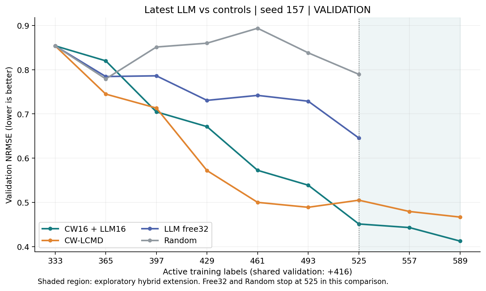
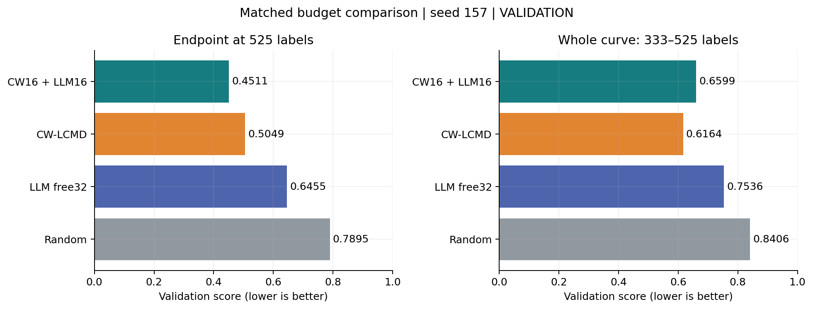
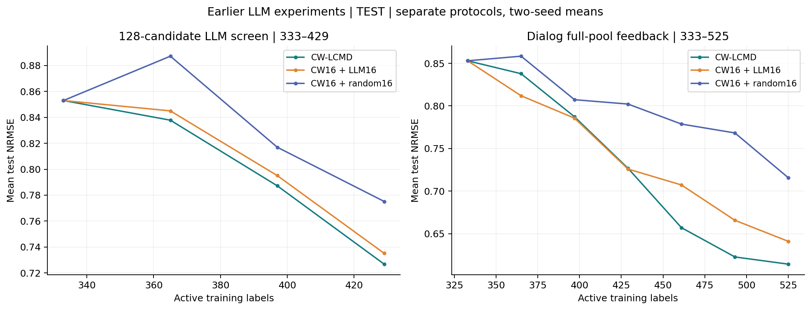
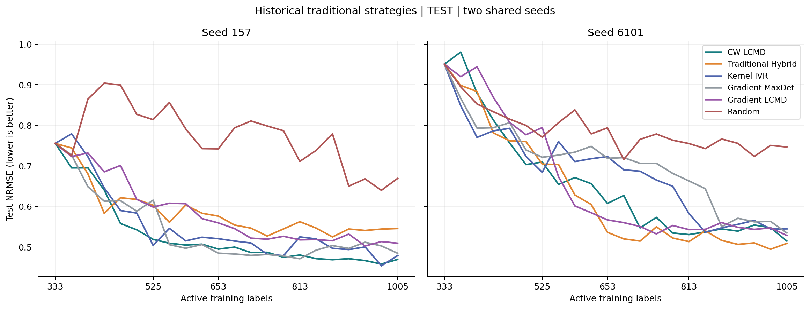
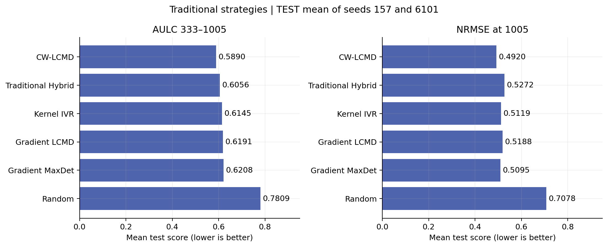
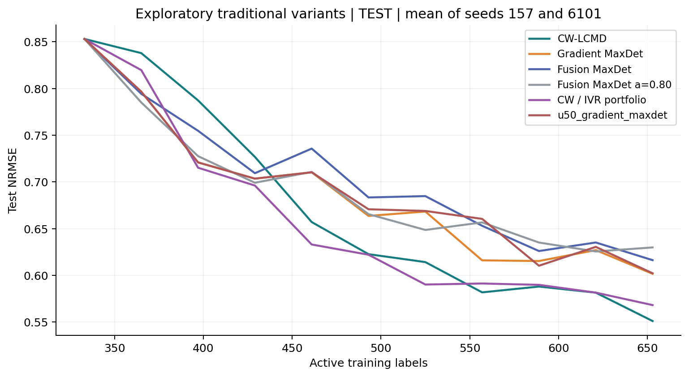

# LLM 与传统主动学习实验整理

截至 2026-10-05；范围为当前仓库 QGeoGNN-V2、4g Row 主动学习实验。本次只读取已保存的汇总指标、训练审计及冻结记录，不训练、不重新评估测试集。旧 E2/A1a predictor 与跨柱 transfer 不并入当前V2排名。

## 先看结论

- 最新全量输入 LLM：seed157 的 free32 完成六轮至525；CW16+LLM16完成八轮至589。seed6101尚未完成对应当前版本轨迹。
- 最新混合策略在525/557/589验证点优于同预算CW；589时0.4124 vs 0.4667，低11.6%。333→589全程验证AULC仍高3.7%，前期落后尚未完全抵消。
- 最新free32在525验证误差优于Random，但不及CW；不能将化学理由合理等同于整体预测收益。
- 历史两个LLM实验已有两seed测试评估：均优于CW+随机补充，均未通过“优于纯CW”的原定扩展门槛。
- 传统完整轨迹在共同seed157/6101口径下，CW-LCMD的333→1005测试AULC及1005终点最好。五seed结果与两seed开发子集须分开报告。

## 比较口径

1. 最新LLM图使用用于checkpoint选择的固定验证集；历史传统图及旧LLM图使用已经发表在仓库的测试指标。两者不作数值直比。
2. 所有图的NRMSE/AULC越低越好。AULC为标签轴上的梯形面积除以区间宽度；不同区间的AULC不可直接排名。
3. 标签轴为主动训练标签，另有固定416条验证标签成本。传统测试主图只取共同seed157/6101，不把五seed均值与单seed值混用。
4. Traditional Hybrid是传统不确定性/多样性策略，不是CW16+LLM16。CW各延续study和历史重用对照去重。
5. 最新free第六轮有第四次模型回复及人工授权单字符ID修正；混合八轮没有人工ID替换。第7–8轮是在看过六轮验证表现后追加的探索性实验。

## 最新LLM：验证集学习曲线

| labels | CW-LCMD | CW16 + LLM16 | LLM free32 | Random |
| --- | --- | --- | --- | --- |
| 333 | 0.8539 | 0.8539 | 0.8539 | 0.8539 |
| 365 | 0.7448 | 0.8200 | 0.7845 | 0.7792 |
| 397 | 0.7133 | 0.7046 | 0.7861 | 0.8512 |
| 429 | 0.5719 | 0.6712 | 0.7306 | 0.8599 |
| 461 | 0.5000 | 0.5724 | 0.7419 | 0.8937 |
| 493 | 0.4888 | 0.5388 | 0.7287 | 0.8381 |
| 525 | 0.5049 | 0.4511 | 0.6455 | 0.7895 |
| 557 | 0.4793 | 0.4430 | — | — |
| 589 | 0.4667 | 0.4124 | — | — |

### 同预算525比较

| method | NRMSE@525 | AULC333–525 |
| --- | --- | --- |
| CW16 + LLM16 | 0.4511 | 0.6599 |
| CW-LCMD | 0.5049 | 0.6164 |
| LLM free32 | 0.6455 | 0.7536 |
| Random | 0.7895 | 0.8406 |

## 较早LLM实验：已完成的测试评估

| 实验目录 | 策略 | seed | 终点标签 | 平均测试NRMSE | 平均测试AULC |
| --- | --- | --- | --- | --- | --- |
| qgeognn_v2_row_llm16_screen | CW-LCMD | 157,6101 | 429 | 0.7268 | 0.8050 |
| qgeognn_v2_row_llm16_screen | CW16 + LLM16 | 157,6101 | 429 | 0.7351 | 0.8114 |
| qgeognn_v2_row_llm16_screen | CW16 + random16 | 157,6101 | 429 | 0.7751 | 0.8394 |
| qgeognn_v2_row_llm_dialog_feedback_v1 | CW-LCMD | 157,6101 | 525 | 0.6142 | 0.7275 |
| qgeognn_v2_row_llm_dialog_feedback_v1 | CW16 + LLM16 | 157,6101 | 525 | 0.6409 | 0.7405 |
| qgeognn_v2_row_llm_dialog_feedback_v1 | CW16 + random16 | 157,6101 | 525 | 0.7156 | 0.7998 |

128候选筛查的333→429平均AULC：LLM 0.8114，CW 0.8050；对话式全池反馈的333→525平均AULC：LLM 0.7405，CW 0.7275。它们不是最新gpt-6-astra全表直送版本，不宜用版本间差值证明模型升级有效。

### 旧版本与未完成试跑清单

| revision | 冻结批次 | 训练产物 | 轨迹最高标签 |
| --- | --- | --- | --- |
| qgeognn_v2_row_llm_full_pool_feedback_v1 | 12 | 12 | {"seed_157/cw16_random16_full_pool": 525, "seed_6101/cw16_random16_full_pool": 525} |
| astra_high_full_pool_20261001 | 14 | 14 | {"seed_157/cw16_llm16_scientist_v2": 589, "seed_157/free_llm32_scientist_v2": 525} |
| query_error_feedback_20260928 | 5 | 5 | {"seed_157/free_llm32_scientist_v2": 493} |
| query_error_feedback_replay_20260928 | 5 | 5 | {"seed_157/free_llm32_scientist_v2": 493} |
| token4research_astra_high_stream_trial_20260930 | 1 | 0 | {} |

没有训练或冻结批次的revision也保存在inventory.json，不能记作效果结果。query_error_feedback及其replay应视为修订/重放记录，不作为独立seed或独立成功实验相加。full_pool_feedback_v1目录主要提供实现及传统补充对照，不能单凭目录名称认定其LLM轨迹已完成。

## 传统策略：共同两seed测试结果

| 策略 | 终点标签 | 平均测试NRMSE | 平均测试AULC333–1005 |
| --- | --- | --- | --- |
| CW-LCMD | 1005 | 0.4920 | 0.5890 |
| Traditional Hybrid | 1005 | 0.5272 | 0.6056 |
| Kernel IVR | 1005 | 0.5119 | 0.6145 |
| Gradient LCMD | 1005 | 0.5188 | 0.6191 |
| Gradient MaxDet | 1005 | 0.5095 | 0.6208 |
| Random | 1005 | 0.7078 | 0.7809 |

### 扩展方法

| 策略 | 终点标签 | 平均测试NRMSE | 平均测试AULC333至各自终点 |
| --- | --- | --- | --- |
| CW / IVR portfolio | 653 | 0.5682 | 0.6549 |
| Fusion MaxDet a=0.80 | 653 | 0.6299 | 0.6895 |
| Fusion MaxDet | 1005 | 0.5306 | 0.6276 |
| u50_gradient_maxdet | 1005 | 0.5219 | 0.6222 |

扩展表各终点不同，图统一截到653用于观察。完整Fusion虽有1005结果，a=0.80与portfolio只到653，不能将其较短区间AULC和1005全程AULC直接比较。

## 所有当前V2 study 的产物盘点

以下按本机实际文件统计；本地fit_audit数量可能含缓存、重用或分支，不代表独立重复数。README与实际产物不一致时，以已保存的结果和审计记录为准。

| study | 本地fit审计 | 结果表数量 | 说明 |
| --- | --- | --- | --- |
| qgeognn_v2_batch_adaptivity | 45 | 14 | Static / adaptive / nested random 的653标签匹配预算控制。 |
| qgeognn_v2_efficiency_review | 0 | 10 | 历史结果再汇总，不是独立新增实验。 |
| qgeognn_v2_ivr_mechanism_audit | 0 | 8 | 机制审计，不是新增预测效果实验。 |
| qgeognn_v2_row_cw_ivr_portfolio_b32 | 20 | 9 | CW/IVR portfolio，两 seed，至653。 |
| qgeognn_v2_row_cw_lcmd_to_1005 | 22 | 10 | CW 两 seed 653→1005 延续。上述四项是一条轨迹的分段，不能当独立重复。 |
| qgeognn_v2_row_cw_lcmd_to_525 | 6 | 9 | CW 两 seed 429→525 延续。 |
| qgeognn_v2_row_cw_lcmd_to_653 | 8 | 9 | CW 两 seed 525→653 延续。 |
| qgeognn_v2_row_fused_maxdet_a080_b32_screen | 20 | 8 | Fusion a=0.80，两 seed，至653。 |
| qgeognn_v2_row_fused_maxdet_b32 | 42 | 12 | Gradient+latent Fusion MaxDet，两 seed，至1005。 |
| qgeognn_v2_row_hybrid_extension | 5 | 10 | 传统 Hybrid 单步匹配扩展，非 LLM。 |
| qgeognn_v2_row_innovation_screen | 0 | 5 | 仅选样几何诊断，无训练效果结论。 |
| qgeognn_v2_row_kernel_ivr_b32 | 105 | 7 | Kernel-IVR 五 seed 连续实验。 |
| qgeognn_v2_row_lcmd | 35 | 11 | 大批量单步 LCMD pilot；不能与 B32 连续曲线直接混排。 |
| qgeognn_v2_row_lcmd_to_ivr_b32 | 22 | 0 | development 有局部结果，尚无 results 正式汇总；不纳入完整轨迹排名。 |
| qgeognn_v2_row_llm16_screen | 12 | 3 | LLM实验，见上文；scientist revision产物单独盘点。 |
| qgeognn_v2_row_llm_dialog_feedback_v1 | 24 | 11 | LLM实验，见上文；scientist revision产物单独盘点。 |
| qgeognn_v2_row_llm_full_pool_feedback_v1 | 12 | 0 | LLM实验，见上文；scientist revision产物单独盘点。 |
| qgeognn_v2_row_llm_scientist_v2 | 8 | 0 | LLM实验，见上文；scientist revision产物单独盘点。 |
| qgeognn_v2_row_master_report | 0 | 1 | 历史结果再汇总，不是独立新增实验。 |
| qgeognn_v2_row_maxdet_b32 | 223 | 20 | Gradient MaxDet / U50 MaxDet，两 seed，至1005。 |
| qgeognn_v2_row_sequential_b32 | 547 | 11 | Random / Gradient LCMD / 传统 Hybrid；五 seed，333→1005。 |
| qgeognn_v2_row_short_sequential_b32 | 12 | 8 | CW-LCMD / Direction-LCMD 两 seed，333→429。 |
| qgeognn_v2_row_small_batch_benchmark | 176 | 19 | B32/B16 多策略单步 benchmark；formal_results 已有结果，README 的未执行说明过时。 |
| qgeognn_v2_same_state_branching | 48 | 16 | 相同状态分支短程实验；不能当从333开始的新独立轨迹。 |
| qgeognn_v2_same_state_branching_cw_hybrid | 48 | 20 | CW/Hybrid源状态分支；结果文件已存在，README的尚未训练说明不宜单独作状态依据。 |

## 建议与证据边界

当前最有价值的是补齐seed6101的相同LLM策略，优先验证混合策略后期优势；保留333→525原窗口作为固定比较，589扩展单列。不要只挑589终点宣称全程效率更高，也不要在新LLM未完成原测试屏障前重新打开测试标签。已有验证曲线无法证明LLM化学知识是收益的原因，需额外消融才可归因。

## 文件与复现

- 本报告：REPORT.md；图：figures/*.png及可编辑矢量SVG。
- latest_validation_curves.json：最新LLM及匹配对照验证数据。
- traditional_test_curves.json / traditional_test_summary.json：传统共同两seed的原始曲线与汇总。
- inventory.json：study和LLM revision实际产物盘点。
- source_manifest.json：直接用于本次图表的源文件SHA256，便于追溯。
- build_report.py：使用fish环境Python运行，可重新生成汇总。

## 补充：传统策略其他已完成设计的数值

以下各表内部可比较，不与上面的单seed验证曲线或不同预算排名混排。

### 五seed连续轨迹（333→1005）

| method | seed_count | test_NRMSE_1005 | test_AULC_333_1005 |
| --- | --- | --- | --- |
| Gradient LCMD | 5 | 0.4086 | 0.4795 |
| Kernel IVR | 5 | 0.3959 | 0.5001 |
| Random | 5 | 0.5433 | 0.6243 |
| Traditional Hybrid | 5 | 0.4097 | 0.4794 |

### B32单步benchmark（333→365）

Random先在每seed内部平均，再在seed间平均，避免多次随机重复改变权重。

| cohort | method | seeds | test_NRMSE_365 |
| --- | --- | --- | --- |
| confirmation | coreset | 5 | 0.6738 |
| confirmation | lcmd | 5 | 0.6631 |
| confirmation | random_mean | 5 | 0.6949 |
| confirmation | uncertainty | 5 | 0.6753 |
| development | coreset | 5 | 0.6987 |
| development | lcmd | 5 | 0.7088 |
| development | random_mean | 5 | 0.7569 |
| development | uncertainty | 5 | 0.7554 |

### 传统Hybrid匹配单步扩展（333→365）

| method | n_outer_seeds | mean_combined_normalized_RMSE |
| --- | --- | --- |
| Random | 5 | 0.6949 |
| Hybrid | 5 | 0.6727 |
| Gradient-LCMD | 5 | 0.6631 |

### 静态与自适应预算控制（终点653）

| method | metric | endpoint_mean | aulc_mean |
| --- | --- | --- | --- |
| adaptive_lcmd | combined_normalized_RMSE | 0.4368 | 0.5444 |
| random | combined_normalized_RMSE | 0.6294 | 0.6691 |
| static_lcmd | combined_normalized_RMSE | 0.4510 | 0.5395 |

### 早期大批量LCMD pilot

| outer_seed | baseline_L0_NRMSE | LCMD_after_NRMSE | Random_after_NRMSE_median |
| --- | --- | --- | --- |
| 73 | 0.9060 | 0.4931 | 0.7998 |
| 311 | 0.8370 | 0.4860 | 0.7385 |
| 1297 | 0.7085 | 0.4469 | 0.6029 |
| 4093 | 0.6538 | 0.3742 | 0.5210 |
| 8191 | 0.7744 | 0.4008 | 0.5995 |

此处为大批量单步设计，不代表B32连续过程。
