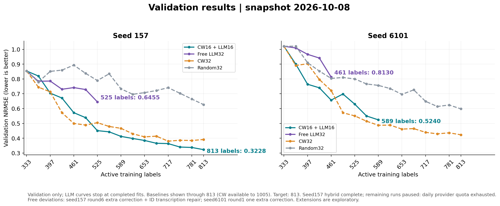
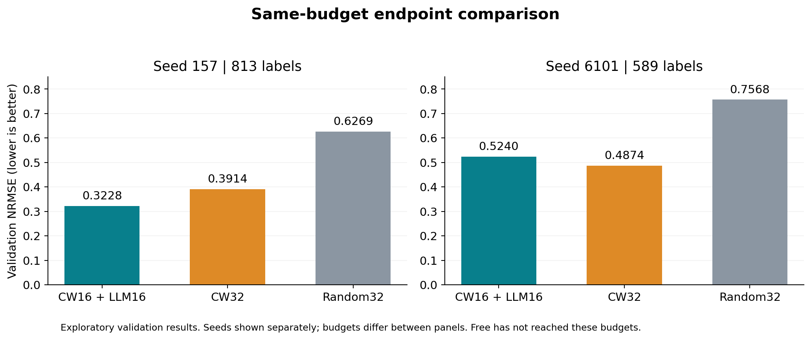

# LLM active-learning validation snapshot — 2026-10-08

## Status

- seed157 CW16+LLM16: 15 batches complete, 813 labels, validation NRMSE 0.32279.
- seed6101 CW16+LLM16: 8 batches complete, 589 labels, validation NRMSE 0.52398. Next selection: 589→621.
- seed6101 Free LLM32: 4 batches complete, 461 labels, validation NRMSE 0.81296. Scheduled after hybrid completion.
- Both CW32 seeds already completed 1005 labels; the plots display their results through 813 for the authorized LLM comparison. At 1005 labels, CW32 validation NRMSE is 0.33505 (seed157) and 0.40200 (seed6101).
- No worker is running at this snapshot. Provider DNS/TLS recovered, but the authenticated probe returned HTTP429 `USAGE_LIMIT_EXCEEDED / DAILY_LIMIT_EXCEEDED`. Monitoring is paused under the user's quota rule. No experiment restart was attempted after quota confirmation.

## Curves and matched-budget comparisons





| Seed | Strategy | Labels | Validation NRMSE ↓ | Normalized validation AULC ↓ |
|---|---|---:|---:|---:|
| 157 | cw16_llm16_scientist_v2 | 813 | 0.32279 | 0.49280 |
| 157 | center_width_lcmd | 813 | 0.39135 | 0.49972 |
| 157 | random32 | 813 | 0.62691 | 0.77040 |
| 6101 | cw16_llm16_scientist_v2 | 589 | 0.52398 | 0.71421 |
| 6101 | center_width_lcmd | 589 | 0.48738 | 0.71300 |
| 6101 | random32 | 589 | 0.75680 | 0.85684 |

AULC is the trapezoidal integral of validation NRMSE against labels from 333 to the stated endpoint, divided by endpoint−333. Comparisons use identical label budgets within each seed. Free is omitted from these endpoint panels because it has not reached their budgets. No cross-seed mean at mismatched budgets is reported.

At 813 labels, seed157 hybrid NRMSE is 17.5% below CW32 and 48.5% below Random32. At 589 labels, seed6101 hybrid remains worse than CW32 (0.52398 versus 0.48738). These results do not establish consistent hybrid superiority across seeds.

## Protocol and interpretation

These are validation results, not test results. No test labels or test report commands were used in preparing this update. The extensions were authorized after viewing earlier validation results, so they are exploratory. Only two seeds are involved and seed6101 is incomplete.

Original model gpt-6-astra/high, full candidate inputs, training, and scientific source hashes remain frozen. Hybrid first freezes CW16 pending, shows these pending selections with all remaining candidates and observed records to the LLM, then selects LLM16 before revealing any batch labels.

Protocol deviations: seed157 Free round6 used an extra correction and ID transcription repair; seed6101 Free round1 used one explicitly authorized extra correction after repeated selection of an already observed ID. That authorization does not extend correction budgets for other rounds.

## Reproducibility and artifacts

`validation_curves.json` contains plotted values; `same_budget_metrics.json` contains comparison metrics. `source_hashes.json` records source JSON hashes, and `completed_fit_audit.json` records verified checkpoint/prediction hashes for completed target fits. Every recorded checkpoint and prediction hash was checked against local bytes during this update.

Regenerate from committed snapshot without local model artifacts:

```sh
python reports/llm_progress_20261008/plot_progress.py --snapshot
```

Without `--snapshot`, the plotting script reads existing local fit audits. The corrected loader includes CW extension `qgeognn_v2_row_cw_lcmd_to_1005`; the earlier graph inadvertently omitted that directory and truncated seed6101 controls at the hybrid endpoint.

Resume only with the revision's `resume_813_hybrid_first.py`, without handoff arguments, after provider quota is available. It retains the Free authorization wrapper, frozen source checks, and schedule seed157 hybrid → seed6101 hybrid → seed6101 Free. Do not use the study CLI run/report/trajectory-report for this continuation.

This update includes new extension/resume scripts, manifests, recovery logs, and non-ignored selection evidence. Existing `.gitignore` rules retain large runtime checkpoints, prediction payloads, and transport caches locally; they are not part of the Git upload. The 2026-10-06 report is a historical snapshot; use this report for current status. The all-target completion result is not yet available.
