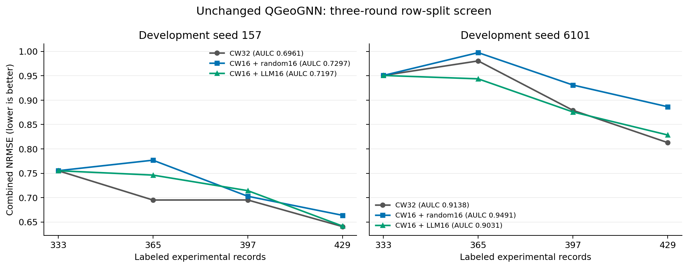

# CW16 + LLM16 开发筛查

**结论：本轮未达到预设扩展门槛。** CW16＋LLM16 的平均 AULC 优于
CW16＋随机16（降低 3.34%，两个 seed 均胜出），但未优于纯 CW32
（升高 0.80%，仅一个 seed 胜出）。最终 NRMSE 在两个 seed 上均略差于纯 CW。
因此不自动延长轮数或增加 seed；这不是对所有 LLM 选点方法的否定。

QGeoGNN 与训练流程保持不变；已完成两 seed、三轮、12 次新增训练和 6 次
LLM 决策。21 项测试、12 个批次的归属及哈希审计通过，LLM 失败与补齐均为 0。
全部轨迹和预测先冻结，之后才统一进行本次测试集评估；历史 CW 测试结果此前已暴露。

两开发 seed（157、6101），333→365→397→429；越低越好。

| method            |   AULC_333_429 |   NRMSE_429 |
|:------------------|---------------:|------------:|
| center_width_lcmd |       0.804957 |    0.726769 |
| cw16_llm16        |       0.811373 |    0.73513  |
| cw16_random16     |       0.839394 |    0.77513  |

## 每 seed 结果

|   seed | method            |   AULC_333_429 |   NRMSE_429 |
|-------:|:------------------|---------------:|------------:|
|    157 | center_width_lcmd |       0.696086 |    0.640645 |
|    157 | cw16_llm16        |       0.719692 |    0.641715 |
|    157 | cw16_random16     |       0.729719 |    0.663741 |
|   6101 | center_width_lcmd |       0.913828 |    0.812892 |
|   6101 | cw16_llm16        |       0.903055 |    0.828544 |
|   6101 | cw16_random16     |       0.949069 |    0.886519 |

## 最终 V1/V2 指标

|   seed | method            |   budget |   V1_RMSE |   V1_MAE |    V1_R2 |   V2_RMSE |   V2_MAE |    V2_R2 |   combined_normalized_RMSE |
|-------:|:------------------|---------:|----------:|---------:|---------:|----------:|---------:|---------:|---------------------------:|
|    157 | center_width_lcmd |      429 |   4.63566 |  2.41592 | 0.611792 |   7.3581  |  3.81935 | 0.762941 |                   0.640645 |
|    157 | cw16_random16     |      429 |   4.82635 |  2.36862 | 0.579197 |   7.56217 |  3.98322 | 0.74961  |                   0.663741 |
|    157 | cw16_llm16        |      429 |   4.5377  |  2.40152 | 0.628025 |   7.63518 |  4.26706 | 0.744752 |                   0.641715 |
|   6101 | center_width_lcmd |      429 |   4.89033 |  2.27954 | 0.605361 |   8.84587 |  4.45568 | 0.631997 |                   0.812892 |
|   6101 | cw16_random16     |      429 |   5.33385 |  2.3965  | 0.530533 |   9.64546 |  4.96786 | 0.562462 |                   0.886519 |
|   6101 | cw16_llm16        |      429 |   5.12691 |  2.38905 | 0.566255 |   8.604   |  4.24546 | 0.651847 |                   0.828544 |

## 决策

{
  "status": "COMPLETED",
  "decision": "NO_EXTENSION_SIGNAL",
  "comparisons": [
    {
      "control": "center_width_lcmd",
      "mean_llm_minus_control": 0.006416418931752432,
      "wins_of_2": 1,
      "per_seed": {
        "157": 0.023606078177374257,
        "6101": -0.010773240313869392
      }
    },
    {
      "control": "cw16_random16",
      "mean_llm_minus_control": -0.028020821979909905,
      "wins_of_2": 2,
      "per_seed": {
        "157": -0.010027137563740518,
        "6101": -0.04601450639607929
      }
    }
  ],
  "LLM_failed_rounds": 0,
  "fallback_picks": 0,
  "evidence": "two-seed three-round development only; chemical reasoning not isolated",
  "model_snapshot_reproducible": false
}

本结果只评价当前对话 LLM 选择策略的增量收益；不证明化学推理有效，不是独立确认。
沿用单模型训练，不新增 ensemble；为避免跨 seed 标签记忆，选点卡片不含真实观测结果。
当前对话模型快照无法固定，历史测试集已在既有研究中暴露；不做显著性声明。
