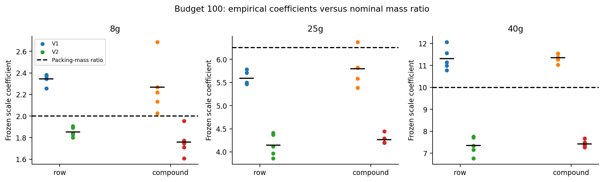
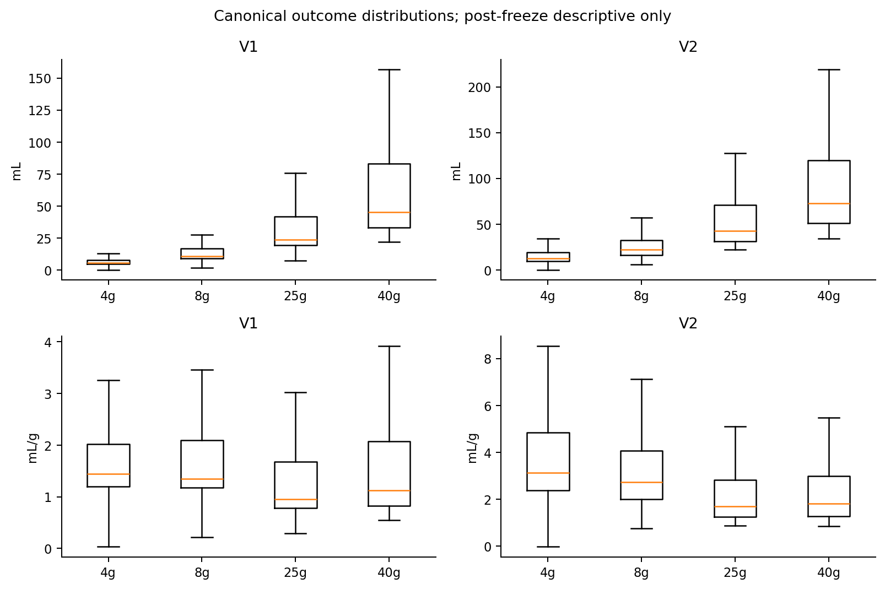
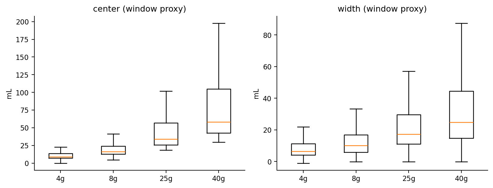
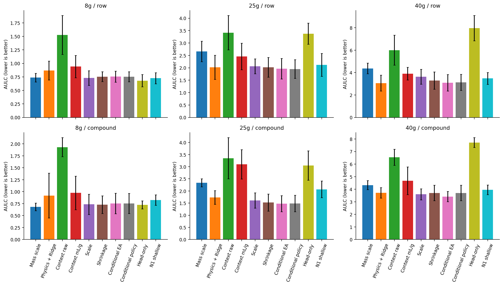
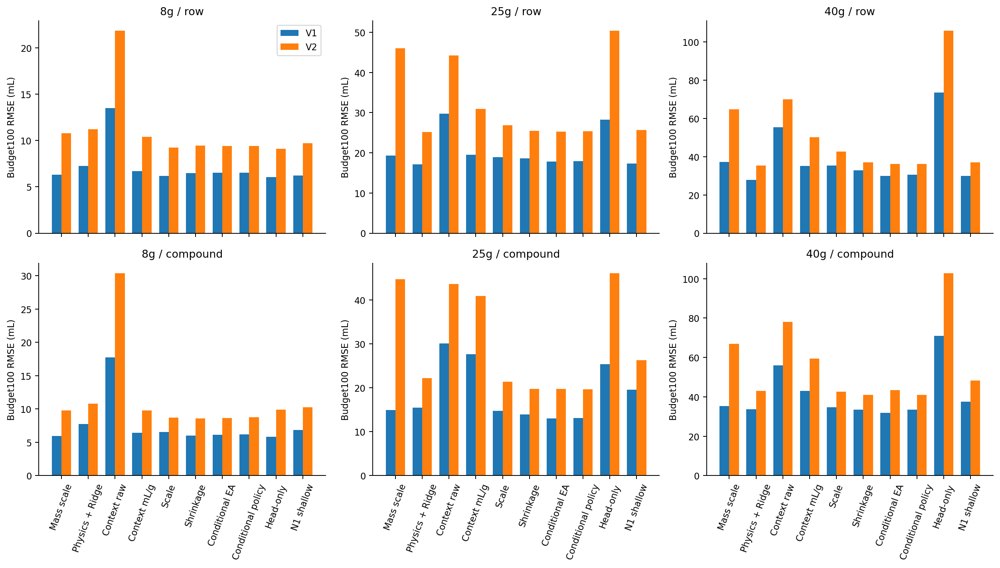
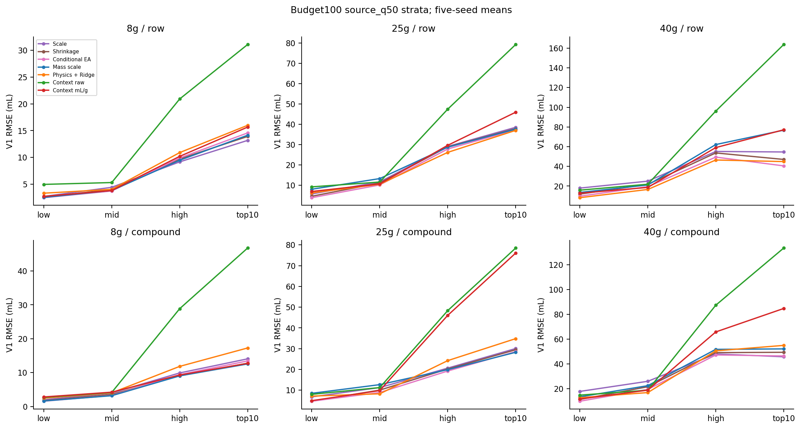
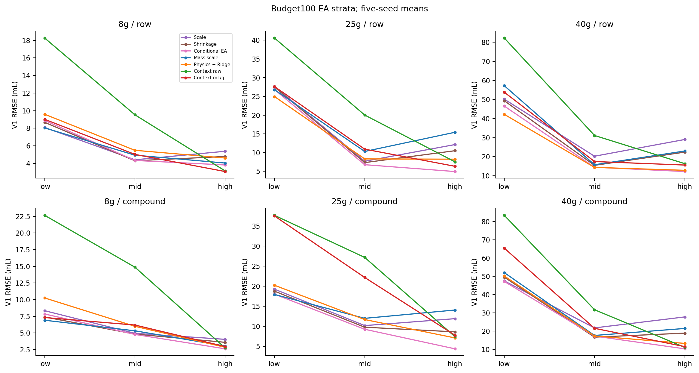

# 显式柱物理条件迁移：科研解释

**CURRENT_DATA_DO_NOT_IDENTIFY_COLUMN_PHYSICS_SUFFICIENTLY**。120 contexts 全部完成，240 neural fits + 120 fixed Ridge fits，四个实验臂与六个冻结参考，共 1200 metric records。全部预测先冻结再评估；历史 test 已暴露，审计只读冻结第一 seed 的已购训练标签，因此仍是开发性证据，不能作为独立外部确认。

## 一、为什么 Scale 看起来这么强？

质量比 2 / 6.25 / 10 捕获跨柱体量变化的一阶方向，但不是拟合系数的精确解释。budget100 compound 的历史 V1/V2 scale 为 8g 2.267/1.759、25g 5.795/4.268、40g 11.353/7.427。同一物理质量比不能同时解释两个输出。OLS 系数是 source-q50 平方加权的 ratio 均值；历史训练上端 10% 占约 46–70% x² 权重。稳定 seed 系数不等于普适物理规律。

仓库有几何硬编码线索，但无可验证单位、床体积/壳体定义、制造商型号和实测来源。REAL_COLUMN_VOLUME_SCALE_NOT_IDENTIFIABLE_FROM_CURRENT_REPOSITORY_METADATA。8g 实为 4g+4g，质量和连接结构不可混为一谈。

## 二、V1 和 V2 为什么 scale 不一样？

训练 exact 8g 配对 center/width 中位比例约 1.87/1.59；relaxed 25g 约 3.88/2.83，40g 约 7.05/3.74。窗口位置与宽度呈不同缩放行为，与 V1/V2 不同系数相容。25g/40g 没有相同 flow 配对，EA、loading 与分子组成也混杂，不能据此宣称 dispersion 的物理因果规律。center 不是色谱峰顶，width 不是峰方差。详见训练分层比例和本轮 center/width errors。

## 三、显式 Column Context 是否有用？

下表为五 seeds 平均 AULC（低优）；每项单独对比全部冻结强参考，未以测试排名创建新选择策略。

| column | protocol | Mass scale | Physics + Ridge | Context raw | Context mL/g | Scale | Shrinkage | Conditional EA | Conditional policy | Head-only | N1 shallow |
| --- | --- | --- | --- | --- | --- | --- | --- | --- | --- | --- | --- |
| 25g | compound | 2.3386 | 1.7321 | 3.3504 | 3.0995 | 1.6074 | 1.5238 | 1.4787 | 1.4839 | 3.05 | 2.0674 |
| 25g | row | 2.659 | 2.0193 | 3.4156 | 2.4554 | 2.0601 | 2.0209 | 1.9664 | 1.9506 | 3.3761 | 2.1166 |
| 40g | compound | 4.3302 | 3.7121 | 6.5484 | 4.673 | 3.6012 | 3.7045 | 3.417 | 3.7045 | 7.719 | 3.9589 |
| 40g | row | 4.3716 | 3.0604 | 6.0031 | 3.9022 | 3.6349 | 3.2862 | 3.0895 | 3.1229 | 7.9644 | 3.4796 |
| 8g | compound | 0.6824 | 0.9179 | 1.9312 | 0.9749 | 0.7349 | 0.7282 | 0.7523 | 0.7528 | 0.725 | 0.8232 |
| 8g | row | 0.7365 | 0.8692 | 1.5262 | 0.942 | 0.7297 | 0.7542 | 0.7549 | 0.7529 | 0.679 | 0.7251 |

相对各场景最低平均 AULC 冻结参考的描述性比较（正 gain 为改善）：

| column | protocol | method | strongest_frozen_aulc_reference | gain_percent | seed_wins | median_paired_delta |
| --- | --- | --- | --- | --- | --- | --- |
| 25g | compound | packing_mass_physical_scale | conditional_EA | -58.1522 | 0 | 0.7835 |
| 25g | compound | physics_scale_residual | conditional_EA | -17.1343 | 1 | 0.2945 |
| 25g | compound | raw_column_conditioned | conditional_EA | -126.5815 | 0 | 1.9203 |
| 25g | compound | mass_normalized_column_conditioned | conditional_EA | -109.6141 | 0 | 1.4851 |
| 25g | row | packing_mass_physical_scale | conditional_policy | -36.3185 | 0 | 0.7099 |
| 25g | row | physics_scale_residual | conditional_policy | -3.5234 | 3 | -0.0636 |
| 25g | row | raw_column_conditioned | conditional_policy | -75.1071 | 0 | 1.4578 |
| 25g | row | mass_normalized_column_conditioned | conditional_policy | -25.8822 | 0 | 0.5517 |
| 40g | compound | packing_mass_physical_scale | conditional_EA | -26.7262 | 0 | 0.8898 |
| 40g | compound | physics_scale_residual | conditional_EA | -8.6369 | 2 | 0.2922 |
| 40g | compound | raw_column_conditioned | conditional_EA | -91.6427 | 0 | 3.0354 |
| 40g | compound | mass_normalized_column_conditioned | conditional_EA | -36.7577 | 0 | 0.9184 |
| 40g | row | packing_mass_physical_scale | conditional_EA | -41.4977 | 0 | 1.4036 |
| 40g | row | physics_scale_residual | conditional_EA | 0.9419 | 3 | -0.0093 |
| 40g | row | raw_column_conditioned | conditional_EA | -94.3086 | 0 | 2.835 |
| 40g | row | mass_normalized_column_conditioned | conditional_EA | -26.3045 | 0 | 0.8527 |
| 8g | compound | packing_mass_physical_scale | target_head_only | 5.8763 | 3 | -0.0455 |
| 8g | compound | physics_scale_residual | target_head_only | -26.6105 | 2 | 0.0801 |
| 8g | compound | raw_column_conditioned | target_head_only | -166.3722 | 0 | 1.2612 |
| 8g | compound | mass_normalized_column_conditioned | target_head_only | -34.4736 | 0 | 0.0901 |
| 8g | row | packing_mass_physical_scale | target_head_only | -8.4771 | 1 | 0.0567 |
| 8g | row | physics_scale_residual | target_head_only | -28.0173 | 0 | 0.1219 |
| 8g | row | raw_column_conditioned | target_head_only | -124.7818 | 0 | 0.7917 |
| 8g | row | mass_normalized_column_conditioned | target_head_only | -38.7437 | 0 | 0.1399 |

所有方法 budget100 绝对误差（mL）及 R²/combined NRMSE：

| column | protocol | method | V1_r2 | V2_r2 | V1_rmse | V2_rmse | V1_mae | V2_mae | combined_normalized_rmse | V1_macro_compound_mae | V2_macro_compound_mae | V1_macro_compound_rmse | V2_macro_compound_rmse |
| --- | --- | --- | --- | --- | --- | --- | --- | --- | --- | --- | --- | --- | --- |
| 25g | compound | conditional_EA | 0.8635 | 0.8777 | 13.007 | 19.7588 | 8.1719 | 12.8207 | 1.456 | 8.6048 | 13.8932 | 11.6206 | 17.8162 |
| 25g | compound | conditional_policy | 0.8608 | 0.879 | 13.0979 | 19.6717 | 8.2684 | 12.776 | 1.4606 | 8.6698 | 13.8772 | 11.7007 | 17.7817 |
| 25g | compound | local_identity_shrinkage | 0.8417 | 0.8778 | 13.9519 | 19.7581 | 8.9088 | 12.4901 | 1.5251 | 9.2728 | 13.6182 | 12.3781 | 17.7421 |
| 25g | compound | mass_normalized_column_conditioned | 0.3307 | 0.4409 | 27.6589 | 40.9119 | 14.3017 | 22.4431 | 3.0662 | 16.4665 | 25.6838 | 23.7873 | 35.7169 |
| 25g | compound | packing_mass_physical_scale | 0.8149 | 0.317 | 14.9327 | 44.7258 | 11.5626 | 38.5384 | 2.3838 | 11.604 | 38.8107 | 13.953 | 42.1474 |
| 25g | compound | physics_scale_residual | 0.779 | 0.8407 | 15.5006 | 22.1801 | 9.8873 | 14.1078 | 1.7014 | 10.1962 | 14.974 | 13.3503 | 19.155 |
| 25g | compound | raw_column_conditioned | 0.2817 | 0.4098 | 30.0894 | 43.5807 | 17.2619 | 24.3662 | 3.3139 | 19.9865 | 28.4163 | 26.3686 | 37.5275 |
| 25g | compound | scale_only | 0.8225 | 0.8564 | 14.7586 | 21.3406 | 10.3312 | 15.0078 | 1.6239 | 10.4964 | 15.3326 | 13.2889 | 19.1025 |
| 25g | compound | standard_shallow_finetune | 0.6903 | 0.7823 | 19.5543 | 26.282 | 11.9398 | 16.0304 | 2.1024 | 13.3049 | 18.2734 | 17.5762 | 23.5482 |
| 25g | compound | target_head_only | 0.4839 | 0.336 | 25.3517 | 46.0398 | 14.5006 | 28.9217 | 3.0462 | 16.283 | 32.5617 | 22.3916 | 42.2928 |
| 25g | row | conditional_EA | 0.7683 | 0.8146 | 17.7824 | 25.2976 | 9.1316 | 15.0367 | 1.9476 | 9.8257 | 15.5806 | 10.6636 | 16.7788 |
| 25g | row | conditional_policy | 0.7655 | 0.8129 | 17.8859 | 25.4275 | 9.2829 | 15.1545 | 1.9585 | 10.0471 | 15.8363 | 10.8772 | 17.0505 |
| 25g | row | local_identity_shrinkage | 0.7464 | 0.8116 | 18.6124 | 25.5262 | 9.9158 | 15.1518 | 2.0144 | 10.7916 | 15.7905 | 11.6274 | 16.9882 |
| 25g | row | mass_normalized_column_conditioned | 0.7198 | 0.7202 | 19.5365 | 30.9239 | 11.3977 | 20.7568 | 2.2339 | 11.6988 | 20.6666 | 12.752 | 22.1476 |
| 25g | row | packing_mass_physical_scale | 0.7251 | 0.3901 | 19.3555 | 46.0042 | 12.6984 | 39.3844 | 2.6682 | 13.4302 | 40.1024 | 14.2092 | 41.0059 |
| 25g | row | physics_scale_residual | 0.783 | 0.8163 | 17.1825 | 25.2051 | 10.0003 | 14.5244 | 1.9003 | 10.529 | 15.254 | 11.366 | 16.3956 |
| 25g | row | raw_column_conditioned | 0.3523 | 0.4303 | 29.7372 | 44.2857 | 17.4981 | 24.6864 | 3.3081 | 18.9366 | 26.8925 | 20.247 | 28.9346 |
| 25g | row | scale_only | 0.7379 | 0.7915 | 18.8818 | 26.8216 | 10.6871 | 15.8155 | 2.0655 | 11.5726 | 16.7231 | 12.3674 | 17.886 |
| 25g | row | standard_shallow_finetune | 0.7753 | 0.809 | 17.3751 | 25.6618 | 10.157 | 14.8989 | 1.9287 | 10.7619 | 15.5653 | 11.5968 | 16.6642 |
| 25g | row | target_head_only | 0.4113 | 0.2701 | 28.2771 | 50.362 | 16.044 | 30.6782 | 3.3691 | 17.4197 | 33.3617 | 18.7784 | 35.5599 |
| 40g | compound | conditional_EA | 0.7598 | 0.7676 | 31.8447 | 43.4552 | 18.6401 | 28.4332 | 3.4415 | 19.0216 | 29.1501 | 25.8923 | 37.2585 |
| 40g | compound | conditional_policy | 0.7321 | 0.7916 | 33.5745 | 40.9652 | 20.0756 | 23.0829 | 3.5109 | 20.4829 | 23.9378 | 27.808 | 31.5218 |
| 40g | compound | local_identity_shrinkage | 0.7321 | 0.7916 | 33.5745 | 40.9652 | 20.0756 | 23.0829 | 3.5109 | 20.4829 | 23.9378 | 27.808 | 31.5218 |
| 40g | compound | mass_normalized_column_conditioned | 0.5636 | 0.5727 | 42.932 | 59.4048 | 24.1638 | 39.0876 | 4.6638 | 25.0172 | 40.8141 | 35.54 | 51.3951 |
| 40g | compound | packing_mass_physical_scale | 0.7039 | 0.453 | 35.3899 | 67.0241 | 21.5689 | 58.2668 | 4.3455 | 21.7979 | 59.1357 | 29.1298 | 64.8004 |
| 40g | compound | physics_scale_residual | 0.7351 | 0.7732 | 33.6091 | 42.9306 | 19.4264 | 25.2326 | 3.5591 | 20.0645 | 26.5776 | 26.9016 | 34.7203 |
| 40g | compound | raw_column_conditioned | 0.2761 | 0.2785 | 55.9094 | 78.0147 | 30.4632 | 42.7263 | 6.0791 | 32.664 | 46.3868 | 46.2434 | 64.8708 |
| 40g | compound | scale_only | 0.7151 | 0.7749 | 34.7391 | 42.7094 | 24.3341 | 28.5146 | 3.6403 | 24.6718 | 29.21 | 30.525 | 36.5713 |
| 40g | compound | standard_shallow_finetune | 0.6727 | 0.7196 | 37.4575 | 48.2673 | 21.9864 | 28.5292 | 3.9764 | 22.6579 | 29.7016 | 29.9411 | 39.1089 |
| 40g | compound | target_head_only | -0.1694 | -0.2614 | 70.9857 | 102.7511 | 47.3263 | 71.6016 | 7.8113 | 48.814 | 74.4105 | 63.8798 | 93.6327 |
| 40g | row | conditional_EA | 0.8168 | 0.8573 | 29.9864 | 36.1906 | 17.3106 | 20.7116 | 3.1277 | 17.6047 | 21.2808 | 19.1794 | 23.0583 |
| 40g | row | conditional_policy | 0.8088 | 0.8569 | 30.5212 | 36.2352 | 18.0184 | 20.7015 | 3.1706 | 18.3624 | 21.2773 | 19.9138 | 23.0469 |
| 40g | row | local_identity_shrinkage | 0.7792 | 0.8504 | 32.9108 | 37.061 | 19.9986 | 20.6929 | 3.3742 | 20.3305 | 21.3069 | 21.9333 | 23.1875 |
| 40g | row | mass_normalized_column_conditioned | 0.7514 | 0.7275 | 35.1696 | 50.068 | 21.209 | 36.8881 | 3.8616 | 21.1463 | 36.7203 | 22.8549 | 38.532 |
| 40g | row | packing_mass_physical_scale | 0.721 | 0.5444 | 37.1376 | 64.7886 | 22.344 | 56.8012 | 4.3902 | 22.7321 | 57.2436 | 24.6967 | 58.4007 |
| 40g | row | physics_scale_residual | 0.8438 | 0.866 | 27.7757 | 35.3427 | 15.9098 | 20.2562 | 2.938 | 16.1016 | 20.5557 | 17.7213 | 22.5754 |
| 40g | row | raw_column_conditioned | 0.3873 | 0.4775 | 55.4236 | 69.9711 | 31.0464 | 39.971 | 5.8563 | 31.5039 | 39.8207 | 34.5413 | 43.7079 |
| 40g | row | scale_only | 0.7439 | 0.8034 | 35.4279 | 42.6607 | 24.6394 | 28.5279 | 3.6924 | 25.3264 | 29.2873 | 26.8434 | 31.1163 |
| 40g | row | standard_shallow_finetune | 0.8198 | 0.8546 | 29.8386 | 36.9523 | 17.6658 | 22.28 | 3.1326 | 17.8468 | 22.5592 | 19.6021 | 24.7278 |
| 40g | row | target_head_only | -0.0827 | -0.1788 | 73.4772 | 105.7242 | 46.4123 | 71.1574 | 8.0691 | 45.6993 | 70.4812 | 49.4442 | 74.9792 |
| 8g | compound | conditional_EA | 0.872 | 0.9093 | 6.1047 | 8.6363 | 3.1678 | 4.7536 | 0.6683 | 3.3195 | 4.9985 | 4.6136 | 6.6152 |
| 8g | compound | conditional_policy | 0.8695 | 0.9083 | 6.1636 | 8.7653 | 3.3837 | 4.5524 | 0.6751 | 3.4796 | 4.8034 | 4.7284 | 6.4775 |
| 8g | compound | local_identity_shrinkage | 0.8766 | 0.9095 | 5.9942 | 8.5941 | 3.2553 | 4.7463 | 0.6604 | 3.3753 | 4.9697 | 4.6324 | 6.6001 |
| 8g | compound | mass_normalized_column_conditioned | 0.8607 | 0.8876 | 6.3961 | 9.7766 | 3.6809 | 5.9195 | 0.7201 | 3.8852 | 6.2193 | 5.2471 | 8.052 |
| 8g | compound | packing_mass_physical_scale | 0.8777 | 0.8799 | 5.9525 | 9.7968 | 2.982 | 6.4445 | 0.6904 | 3.1492 | 6.6646 | 4.6042 | 8.3503 |
| 8g | compound | physics_scale_residual | 0.7806 | 0.8627 | 7.7345 | 10.7735 | 4.0824 | 5.8228 | 0.8412 | 4.3412 | 6.2576 | 5.7558 | 8.2318 |
| 8g | compound | raw_column_conditioned | -0.0783 | -0.0842 | 17.7538 | 30.3485 | 8.6961 | 15.4835 | 2.0795 | 9.71 | 17.2904 | 13.5594 | 23.4929 |
| 8g | compound | scale_only | 0.8532 | 0.9091 | 6.5302 | 8.7204 | 3.782 | 4.5607 | 0.7017 | 3.8823 | 4.8114 | 5.0912 | 6.4676 |
| 8g | compound | standard_shallow_finetune | 0.8337 | 0.8729 | 6.858 | 10.2712 | 3.5217 | 5.1464 | 0.7654 | 3.8206 | 5.6175 | 5.5029 | 7.6523 |
| 8g | compound | target_head_only | 0.8824 | 0.8867 | 5.8515 | 9.8832 | 3.0411 | 4.7001 | 0.6843 | 3.1883 | 5.1172 | 4.6332 | 7.0845 |
| 8g | row | conditional_EA | 0.8492 | 0.8693 | 6.5131 | 9.4206 | 3.4666 | 5.5509 | 0.722 | 3.3669 | 5.4494 | 3.7487 | 5.9744 |
| 8g | row | conditional_policy | 0.8492 | 0.8696 | 6.513 | 9.4111 | 3.5479 | 5.5636 | 0.7218 | 3.4346 | 5.4629 | 3.8214 | 5.9871 |
| 8g | row | local_identity_shrinkage | 0.8506 | 0.8683 | 6.4735 | 9.4602 | 3.5496 | 5.6362 | 0.7201 | 3.4285 | 5.5308 | 3.8236 | 6.0506 |
| 8g | row | mass_normalized_column_conditioned | 0.8359 | 0.8539 | 6.6787 | 10.3766 | 3.9453 | 6.6072 | 0.7558 | 3.9682 | 6.6995 | 4.3383 | 7.2274 |
| 8g | row | packing_mass_physical_scale | 0.8555 | 0.8348 | 6.3134 | 10.801 | 3.2854 | 6.869 | 0.7426 | 3.1617 | 6.688 | 3.5508 | 7.2604 |
| 8g | row | physics_scale_residual | 0.8073 | 0.827 | 7.255 | 11.2101 | 4.0553 | 6.3312 | 0.8181 | 3.9318 | 6.1321 | 4.3377 | 6.767 |
| 8g | row | raw_column_conditioned | 0.3772 | 0.294 | 13.4757 | 21.8247 | 7.1064 | 12.142 | 1.5514 | 7.0413 | 11.9268 | 7.7999 | 13.2694 |
| 8g | row | scale_only | 0.8529 | 0.8746 | 6.1985 | 9.2436 | 3.8249 | 5.5198 | 0.6905 | 3.7244 | 5.4169 | 4.0683 | 5.9367 |
| 8g | row | standard_shallow_finetune | 0.8599 | 0.868 | 6.2141 | 9.6995 | 3.5553 | 5.7381 | 0.7034 | 3.5419 | 5.6705 | 3.879 | 6.1997 |
| 8g | row | target_head_only | 0.8634 | 0.8788 | 6.0699 | 9.1229 | 3.3431 | 5.2979 | 0.6789 | 3.2912 | 5.1703 | 3.6279 | 5.685 |

预注册 material gate：

| method | endpoint | replicated | passing_contexts |
| --- | --- | --- | --- |
| packing_mass_physical_scale | aulc | False | [] |
| packing_mass_physical_scale | budget100 | False | [] |
| physics_scale_residual | aulc | False | [] |
| physics_scale_residual | budget100 | False | [['40g', 'row']] |
| raw_column_conditioned | aulc | False | [] |
| raw_column_conditioned | budget100 | False | [] |
| mass_normalized_column_conditioned | aulc | False | [] |
| mass_normalized_column_conditioned | budget100 | False | [] |

完整每 seed/budget 指标在 all_metrics.csv，标准差/中位数/范围在 aggregate_metrics.csv；40g 的绝对误差必须与 NRMSE 同时阅读，不能称 TRANSFER_SOLVED。

## 四、Physical Scale + Residual 是否优于经验 Scale/Shrinkage？

固定 alpha=100 的 Ridge 使用 frozen 128D 分子表示、EA 与四个柱工程变量；没有验证集 alpha 搜索。是否更准以以上逐场景 AULC 和 budget100 errors 为准，稳定性以 aulc_summary.csv 的跨 seed SD 与 paired_comparisons.csv 为准。q50/EA 分层图及 error_stratification.csv 保留低/中/高与尾部失败，局部改善不能替代整体 material gate。

Residual 对强参考的定量比较（正数表示改善；seed SD 是重叠分区下的变动，不是独立实验方差）：

| column | protocol | reference | aulc_gain_percent | wins | residual_seed_sd | reference_seed_sd | source_q50_low_V1_rmse_gain_percent | source_q50_top10_V1_rmse_gain_percent | EA_low_V1_rmse_gain_percent | EA_high_V1_rmse_gain_percent |
| --- | --- | --- | --- | --- | --- | --- | --- | --- | --- | --- |
| 25g | compound | scale_only | -7.7527 | 1 | 0.2787 | 0.3167 | -5.1793 | -15.8444 | -5.0669 | 40.2916 |
| 25g | compound | local_identity_shrinkage | -13.6683 | 1 | 0.2787 | 0.3506 | -51.783 | -18.1544 | -7.8681 | 17.5446 |
| 25g | compound | conditional_EA | -17.1343 | 1 | 0.2787 | 0.3327 | -52.1642 | -21.8748 | -12.2823 | -61.9527 |
| 25g | row | scale_only | 1.9819 | 4 | 0.4873 | 0.2992 | -9.3497 | 3.9286 | 9.7638 | 32.156 |
| 25g | row | local_identity_shrinkage | 0.0798 | 3 | 0.4873 | 0.3989 | -36.934 | 2.2377 | 9.2446 | 21.5404 |
| 25g | row | conditional_EA | -2.6911 | 3 | 0.4873 | 0.4119 | -62.6359 | 0.7061 | 6.9841 | -66.7909 |
| 40g | compound | scale_only | -3.079 | 2 | 0.4146 | 0.441 | 28.3314 | -20.0419 | -5.6265 | 52.1061 |
| 40g | compound | local_identity_shrinkage | -0.2053 | 3 | 0.4146 | 0.6201 | -12.2726 | -11.2798 | -1.2488 | 29.6435 |
| 40g | compound | conditional_EA | -8.6369 | 2 | 0.4146 | 0.4091 | -28.1235 | -18.2886 | -6.2831 | -28.6651 |
| 40g | row | scale_only | 15.8046 | 5 | 0.71 | 0.666 | 54.1877 | 17.8617 | 15.8559 | 55.7375 |
| 40g | row | local_identity_shrinkage | 6.872 | 5 | 0.71 | 0.7651 | 30.7137 | 4.6152 | 14.4312 | 42.6244 |
| 40g | row | conditional_EA | 0.9419 | 3 | 0.71 | 0.7352 | 15.6126 | -10.7707 | 9.2948 | -5.2462 |
| 8g | compound | scale_only | -24.908 | 1 | 0.4688 | 0.2113 | -24.0073 | -22.7764 | -22.9619 | 29.4621 |
| 8g | compound | local_identity_shrinkage | -26.0622 | 2 | 0.4688 | 0.1838 | -42.3656 | -35.1406 | -38.5811 | 20.6591 |
| 8g | compound | conditional_EA | -22.0167 | 2 | 0.4688 | 0.2143 | -56.9839 | -28.3576 | -30.6677 | -8.8369 |
| 8g | row | scale_only | -19.1265 | 0 | 0.1743 | 0.1363 | -22.4328 | -21.3916 | -18.648 | 14.2548 |
| 8g | row | local_identity_shrinkage | -15.2465 | 0 | 0.1743 | 0.0917 | -29.7173 | -14.9455 | -10.631 | 3.6246 |
| 8g | row | conditional_EA | -15.1388 | 0 | 0.1743 | 0.1025 | -33.8307 | -9.7692 | -7.9274 | -20.7031 |

## 五、归一化目标有没有让跨柱问题变简单？

PHYSICAL_NORMALIZATION_PARTIALLY_SUPPORTED（训练审计）。四柱均值 CV：V1 0.846→0.149，V2 0.751→0.265，center 0.787→0.220，width 0.606→0.427。单柱 CV 除以常量后代数上不变；不能用它证明学习更简单。mL/g 输出的实际测试增益和 seed SD 由 raw/context mL/g 两臂检验，不将分布收拢等同于预测提升。postfreeze_target_distributions.csv 和 postfreeze_matched_discrepancy.csv 是全 canonical 数据的事后描述，未反馈模型。

Normalized versus raw 的直接比较：

| column | protocol | raw_aulc | normalized_aulc | aulc_gain_percent | wins | raw_seed_sd | normalized_seed_sd | budget100_combined_gain_percent |
| --- | --- | --- | --- | --- | --- | --- | --- | --- |
| 25g | compound | 3.3504 | 3.0995 | 7.4885 | 4 | 0.8479 | 0.6031 | 7.4749 |
| 25g | row | 3.4156 | 2.4554 | 28.1113 | 5 | 0.6906 | 0.5333 | 32.4727 |
| 40g | compound | 6.5484 | 4.673 | 28.6392 | 5 | 0.642 | 1.1016 | 23.2802 |
| 40g | row | 6.0031 | 3.9022 | 34.998 | 5 | 1.3364 | 0.5655 | 34.0604 |
| 8g | compound | 1.9312 | 0.9749 | 49.5166 | 5 | 0.199 | 0.35 | 65.3725 |
| 8g | row | 1.5262 | 0.942 | 38.2763 | 5 | 0.3589 | 0.2064 | 51.2812 |

归一化臂初始 source function 在 mL 上保持一致，但 target 初值已经包含 packing_mass_ratio，而 raw 臂初值仍为 source q50；故该比较同时包含物理初值结构与 loss 数值尺度的影响，不是唯一识别数值优化难度的因果实验。

## 六、后续 Active Learning baseline

没有新模型同时满足两个复制端点的提升门槛。保留 Scale/Shrinkage 为主要 baseline 家族，Conditional EA/policy 与竞争性的 8g head-only 作冻结对照；不因单个场景 test 最优而构建 oracle，也不在本轮启动 AL。

## 七、数据还缺什么？

优先补真实 V0/示踪方法、柱内径/床长、粒径与 packing density、准确产品型号/批次和 4g+4g 连接体积；独立重复与批次 ID；crossed mass×flow（当前 4g 有 4/5/6/8/10，target 8g/25g/40g 固定 10/15/30 mL/min）；高 retention tail 和 source-unseen compounds。质量、几何、flow 无法独立识别。flow mL/min 不是线速度；flow_per_g 只是工程 proxy。模型成功也只能说明 explicit context has predictive value，不能说明质量或 flow 导致 shift；失败也不能证明不存在物理结构。

## 图表

## Budget100 center/width errors (mL)

| column | protocol | method | target | rmse | mae |
| --- | --- | --- | --- | --- | --- |
| 25g | compound | conditional_EA | center | 15.3948 | 9.8209 |
| 25g | compound | conditional_EA | width | 12.988 | 9.1992 |
| 25g | compound | conditional_policy | center | 15.3531 | 9.7902 |
| 25g | compound | conditional_policy | width | 13.0752 | 9.3274 |
| 25g | compound | local_identity_shrinkage | center | 15.7034 | 9.776 |
| 25g | compound | local_identity_shrinkage | width | 13.3983 | 9.7613 |
| 25g | compound | mass_normalized_column_conditioned | center | 33.3389 | 17.4112 |
| 25g | compound | mass_normalized_column_conditioned | width | 19.6332 | 13.4485 |
| 25g | compound | packing_mass_physical_scale | center | 27.2841 | 23.6631 |
| 25g | compound | packing_mass_physical_scale | width | 38.385 | 32.0337 |
| 25g | compound | physics_scale_residual | center | 18.3064 | 11.7086 |
| 25g | compound | physics_scale_residual | width | 11.1796 | 7.7062 |
| 25g | compound | raw_column_conditioned | center | 36.5672 | 20.4593 |
| 25g | compound | raw_column_conditioned | width | 16.1936 | 9.9217 |
| 25g | compound | scale_only | center | 17.287 | 12.2733 |
| 25g | compound | scale_only | width | 12.1714 | 8.6796 |
| 25g | compound | standard_shallow_finetune | center | 22.53 | 13.7218 |
| 25g | compound | standard_shallow_finetune | width | 10.7285 | 7.0122 |
| 25g | compound | target_head_only | center | 35.3516 | 21.3958 |
| 25g | compound | target_head_only | width | 22.9106 | 15.377 |
| 25g | row | conditional_EA | center | 20.6283 | 11.181 |
| 25g | row | conditional_EA | width | 14.4495 | 10.2958 |
| 25g | row | conditional_policy | center | 20.7172 | 11.3064 |
| 25g | row | conditional_policy | width | 14.6992 | 10.4007 |
| 25g | row | local_identity_shrinkage | center | 21.0731 | 11.4101 |
| 25g | row | local_identity_shrinkage | width | 14.8076 | 10.7669 |
| 25g | row | mass_normalized_column_conditioned | center | 24.2044 | 15.2864 |
| 25g | row | mass_normalized_column_conditioned | width | 18.4749 | 13.2549 |
| 25g | row | packing_mass_physical_scale | center | 30.0069 | 24.9292 |
| 25g | row | packing_mass_physical_scale | width | 37.175 | 31.2703 |
| 25g | row | physics_scale_residual | center | 20.6733 | 11.7978 |
| 25g | row | physics_scale_residual | width | 12.3136 | 8.1443 |
| 25g | row | raw_column_conditioned | center | 36.6945 | 20.7656 |
| 25g | row | raw_column_conditioned | width | 17.6196 | 10.0953 |
| 25g | row | scale_only | center | 22.1976 | 12.7875 |
| 25g | row | scale_only | width | 13.4663 | 9.0438 |
| 25g | row | standard_shallow_finetune | center | 21.1437 | 12.1587 |
| 25g | row | standard_shallow_finetune | width | 11.6052 | 7.2536 |
| 25g | row | target_head_only | center | 39.0408 | 23.0511 |
| 25g | row | target_head_only | width | 24.0096 | 15.5976 |
| 40g | compound | conditional_EA | center | 35.4068 | 21.9685 |
| 40g | compound | conditional_EA | width | 28.2068 | 20.1302 |
| 40g | compound | conditional_policy | center | 35.1699 | 19.1824 |
| 40g | compound | conditional_policy | width | 25.5294 | 18.7793 |
| 40g | compound | local_identity_shrinkage | center | 35.1699 | 19.1824 |
| 40g | compound | local_identity_shrinkage | width | 25.5294 | 18.7793 |
| 40g | compound | mass_normalized_column_conditioned | center | 47.1599 | 27.9665 |
| 40g | compound | mass_normalized_column_conditioned | width | 41.3165 | 32.2905 |
| 40g | compound | packing_mass_physical_scale | center | 43.0145 | 34.5994 |
| 40g | compound | packing_mass_physical_scale | width | 64.1142 | 53.944 |
| 40g | compound | physics_scale_residual | center | 37.6141 | 21.8484 |
| 40g | compound | physics_scale_residual | width | 16.9494 | 11.6643 |
| 40g | compound | raw_column_conditioned | center | 66.5963 | 36.3588 |
| 40g | compound | raw_column_conditioned | width | 26.1426 | 15.2594 |
| 40g | compound | scale_only | center | 37.3553 | 25.7974 |
| 40g | compound | scale_only | width | 21.8179 | 15.6967 |
| 40g | compound | standard_shallow_finetune | center | 42.4258 | 24.9454 |
| 40g | compound | standard_shallow_finetune | width | 16.3006 | 10.6871 |
| 40g | compound | target_head_only | center | 86.592 | 59.4294 |
| 40g | compound | target_head_only | width | 34.6709 | 24.4319 |
| 40g | row | conditional_EA | center | 31.5057 | 17.7925 |
| 40g | row | conditional_EA | width | 21.0757 | 15.2816 |
| 40g | row | conditional_policy | center | 31.72 | 17.9304 |
| 40g | row | conditional_policy | width | 21.4889 | 15.6394 |
| 40g | row | local_identity_shrinkage | center | 33.1916 | 18.5253 |
| 40g | row | local_identity_shrinkage | width | 22.3068 | 16.6631 |
| 40g | row | mass_normalized_column_conditioned | center | 39.3348 | 27.0973 |
| 40g | row | mass_normalized_column_conditioned | width | 36.5371 | 26.1888 |
| 40g | row | packing_mass_physical_scale | center | 41.0919 | 32.9184 |
| 40g | row | packing_mass_physical_scale | width | 66.3066 | 55.732 |
| 40g | row | physics_scale_residual | center | 30.9128 | 17.4296 |
| 40g | row | physics_scale_residual | width | 14.7849 | 10.0616 |
| 40g | row | raw_column_conditioned | center | 61.6502 | 34.6808 |
| 40g | row | raw_column_conditioned | width | 26.7902 | 16.7325 |
| 40g | row | scale_only | center | 37.9101 | 25.9015 |
| 40g | row | scale_only | width | 20.0159 | 14.7189 |
| 40g | row | standard_shallow_finetune | center | 32.8588 | 19.5797 |
| 40g | row | standard_shallow_finetune | width | 13.8895 | 9.0508 |
| 40g | row | target_head_only | center | 89.3234 | 58.715 |
| 40g | row | target_head_only | width | 35.1971 | 24.9461 |
| 8g | compound | conditional_EA | center | 6.8447 | 3.5968 |
| 8g | compound | conditional_EA | width | 6.0423 | 3.8102 |
| 8g | compound | conditional_policy | center | 6.9548 | 3.5806 |
| 8g | compound | conditional_policy | width | 6.0089 | 3.7304 |
| 8g | compound | local_identity_shrinkage | center | 6.7144 | 3.5767 |
| 8g | compound | local_identity_shrinkage | width | 6.3659 | 3.9829 |
| 8g | compound | mass_normalized_column_conditioned | center | 7.4947 | 4.4384 |
| 8g | compound | mass_normalized_column_conditioned | width | 7.0565 | 4.5565 |
| 8g | compound | packing_mass_physical_scale | center | 6.5445 | 3.8714 |
| 8g | compound | packing_mass_physical_scale | width | 9.6684 | 6.5883 |
| 8g | compound | physics_scale_residual | center | 8.8874 | 4.6773 |
| 8g | compound | physics_scale_residual | width | 5.8715 | 3.5195 |
| 8g | compound | raw_column_conditioned | center | 23.8458 | 11.9241 |
| 8g | compound | raw_column_conditioned | width | 14.0734 | 7.5913 |
| 8g | compound | scale_only | center | 7.1074 | 3.7889 |
| 8g | compound | scale_only | width | 5.9529 | 3.6845 |
| 8g | compound | standard_shallow_finetune | center | 8.187 | 4.1099 |
| 8g | compound | standard_shallow_finetune | width | 6.051 | 3.4786 |
| 8g | compound | target_head_only | center | 7.4194 | 3.5473 |
| 8g | compound | target_head_only | width | 6.6436 | 3.6164 |
| 8g | row | conditional_EA | center | 7.3639 | 4.1528 |
| 8g | row | conditional_EA | width | 7.002 | 4.4502 |
| 8g | row | conditional_policy | center | 7.3369 | 4.1459 |
| 8g | row | conditional_policy | width | 7.0874 | 4.5043 |
| 8g | row | local_identity_shrinkage | center | 7.3491 | 4.1797 |
| 8g | row | local_identity_shrinkage | width | 7.0952 | 4.5422 |
| 8g | row | mass_normalized_column_conditioned | center | 8.0612 | 5.0042 |
| 8g | row | mass_normalized_column_conditioned | width | 6.7391 | 4.5389 |
| 8g | row | packing_mass_physical_scale | center | 7.2266 | 4.2309 |
| 8g | row | packing_mass_physical_scale | width | 10.2301 | 7.1059 |
| 8g | row | physics_scale_residual | center | 8.9164 | 4.9778 |
| 8g | row | physics_scale_residual | width | 6.1831 | 3.9814 |
| 8g | row | raw_column_conditioned | center | 17.3619 | 9.3254 |
| 8g | row | raw_column_conditioned | width | 10.6047 | 6.5982 |
| 8g | row | scale_only | center | 7.2561 | 4.304 |
| 8g | row | scale_only | width | 6.1658 | 3.9857 |
| 8g | row | standard_shallow_finetune | center | 7.6058 | 4.385 |
| 8g | row | standard_shallow_finetune | width | 5.8503 | 3.8326 |
| 8g | row | target_head_only | center | 7.2078 | 3.9877 |
| 8g | row | target_head_only | width | 5.715 | 3.6637 |
