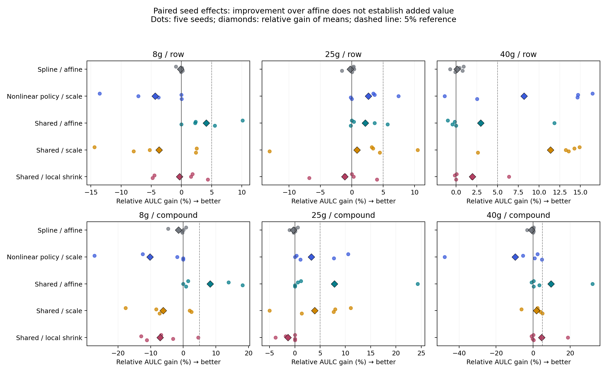

# 结果解释与停止决定

**`NO_COMPLEXITY_JUSTIFIED_BY_CURRENT_DATA`**。两个预注册诊断完成 120/120 contexts、960 条方法评估记录，未追加模型。新分支基于 `61f20c9`。

当前证据不支持把更复杂映射或共享模型作为下一阶段主线。尤其不能只引用 shared 相对 affine 的正结果：较强的 scale-only 和独立 shrinkage 对照解释了大部分表面收益。

## 非线性映射：没有足够证据支持

单独 monotone spline 的 compound 三柱平均 AULC 比 affine 恶化 0.73%，三个柱都没有达到相对 affine 的稳定/material 门槛。validation 允许回退到 scale/affine 后，nonlinear policy 相对 affine 改善 2.01%，但比 scale-only 恶化 6.20%，比同样使用 validation 的 linear policy 恶化 1.08%。因此不能把回退到简单模型带来的改善归因于非线性。

## 跨柱共享：相对 affine 有收益，但未超过简单对照的实际意义门槛

compound 总预算 portfolio AULC：affine 2.1471、scale-only 1.9812、独立 identity shrinkage 1.9855、shared 1.9530。shared 相对 affine 改善 9.04%，但相对 scale-only 只有 1.42%，相对独立 shrinkage 只有 1.64%。row portfolio 相对 affine 的改善也只有 2.84%。

| column | reference | wins | seeds | stable_material | relative_mean_gain_percent |
| --- | --- | --- | --- | --- | --- |
| 25g | scale_only | 4 | 5 | False | 3.93402125 |
| 25g | affine | 5 | 5 | True | 7.8263419 |
| 25g | local_identity_shrinkage | 1 | 5 | False | -1.33998069 |
| 40g | scale_only | 4 | 5 | False | 1.83977445 |
| 40g | affine | 4 | 5 | True | 9.72726435 |
| 40g | local_identity_shrinkage | 3 | 5 | False | 4.57637542 |
| 8g | scale_only | 2 | 5 | False | -6.11030631 |
| 8g | affine | 4 | 5 | True | 8.2693499 |
| 8g | local_identity_shrinkage | 1 | 5 | False | -7.09078754 |

25g/40g compound 的 shared 相对 affine 赢 5/5、4/5 seeds；但相对 scale 只改善 3.93%、1.84%，相对 local shrinkage 分别恶化 1.34%、改善 4.58%（仅 1/5、3/5 wins）。8g shared 还弱于 scale/head。没有柱通过全部预注册对照，更谈不上跨两个柱稳定保留。此结果允许说“partial pooling 能缓解部分 affine 拟合不稳定”，不允许说“已经发现额外的跨柱可迁移结构”。

预算比较单位是三柱 portfolio，每柱 B=30/50/70/100，总计划 90/150/210/300。所有 portfolio 方法使用相同购买清单并计入 validation；compound 的实际总预算为 88–299，按具体 seed/budget 原样保留。共享模型的逐柱性能不能被称为仅消耗 B 标签。focal compound validation/test 在所有供体训练中隔离；未新增标签、未重划 split。

## Compound AULC（五 seed 均值；越低越好）

| column | scale_only | affine | target_head_only | monotone_spline | nonlinear_policy | linear_policy | shared_column_affine | local_identity_shrinkage |
| --- | --- | --- | --- | --- | --- | --- | --- | --- |
| 25g | 1.60743406 | 1.67531299 | 3.05001093 | 1.68008512 | 1.55482259 | 1.56140873 | 1.54419727 | 1.52377892 |
| 40g | 3.60119812 | 3.9158492 | 7.71900745 | 3.94601336 | 3.94721686 | 3.91584918 | 3.5349442 | 3.70447487 |
| 8g | 0.734889677 | 0.850090658 | 0.72500775 | 0.862361764 | 0.809743235 | 0.767353952 | 0.779793687 | 0.728161315 |

## 剩余 absolute error 没有实质解决

预算 100 的 compound 指标如下（RMSE/MAE 单位 mL）。25g 的 V1/V2 RMSE 仍约 14/20，40g 仍约 34/41；共享的 AULC 改善没有转化成高预算下的大幅 absolute-error 降低。

| column | method | V1_rmse | V2_rmse | V1_mae | V2_mae | V1_r2 | V2_r2 |
| --- | --- | --- | --- | --- | --- | --- | --- |
| 25g | affine | 14.1437998 | 20.1297115 | 8.84463892 | 12.6080769 | 0.836770811 | 0.872567103 |
| 25g | monotone_spline | 14.1454853 | 20.0477875 | 8.84321359 | 12.3854633 | 0.836679294 | 0.873762953 |
| 25g | shared_column_affine | 14.1559593 | 19.843129 | 8.8477823 | 12.5049031 | 0.836447293 | 0.876662023 |
| 40g | affine | 33.5744582 | 40.9652489 | 20.0755742 | 23.0829021 | 0.732092815 | 0.791624055 |
| 40g | monotone_spline | 33.5434612 | 40.9101628 | 20.1037057 | 22.2834717 | 0.732688376 | 0.791639205 |
| 40g | shared_column_affine | 33.5385647 | 40.87521 | 19.9534299 | 22.7799382 | 0.733294213 | 0.793385546 |

这两项诊断并不能唯一地区分“sum readout 限制”和“信息量/噪声限制”，也不能证明一切 nonlinear mapping 都无效。当前拒绝的是所测两个低容量机制作为下一条复杂模型主线；**不是证明 residual 是不可约噪声，也不是自动获得 readout 改造依据**。Adaptive readout 在历史中未真正测试，本轮亦未训练；不输出 `ADAPTIVE_READOUT_WARRANTED`。

## 数据需要与边界

执行本轮有限诊断不需要额外数据。继续做机制辨别或确认增益则优先需要：独立实验批次/compound 的确认集；相同条件下的重复实验来估计测量误差；同 mass 多 flow、同 flow 多 mass 的交叉设计；高 source-q50 尾部覆盖。当前仅三个规格且 flow 各自恒定，mass/flow 效应无法分离。target-compound holdout 不代表 source-unseen OOD；后者需要更多真正未见分子。

所有 test 均是历史已使用的冻结开发性评估。knots/scalers/coefficients 仅由 train 拟合，validation 选固定候选，全部预测冻结后执行本轮 test 评估；未用 test 调参或追加方法。

## 复现与证据

```bash
KMP_DUPLICATE_LIB_OK=TRUE MPLCONFIGDIR=/tmp/transfer-diagnostics-mpl conda run --no-capture-output -n fish python scripts/studies/run_next_transfer_diagnostics.py --run
MPLCONFIGDIR=/tmp/transfer-diagnostics-mpl conda run --no-capture-output -n fish python scripts/studies/summarize_next_transfer_diagnostics.py
```

复现依赖原 qualified source runtime checkpoint，其哈希由 protocol 锁定；不允许用重新训练的随机 checkpoint 静默替代。已有 predictions/fit audits 全部可跟踪，源码与协议变化会停止复用。

- [预实验审计](../../../NEXT_TRANSFER_MODEL_AUDIT.md)
- [完整指标报告](NEXT_TRANSFER_DIAGNOSTICS_REPORT.md)：R²、RMSE、MAE、arithmetic/RMS NRMSE、AULC 与 seed stability。
- [逐 seed/预算指标](all_metrics.csv)、[全部配对对照](paired_aulc.csv)、[actual-budget AULC](portfolio_aulc.csv)。
- [标签预算与供体排除](label_usage_summary.csv)、[validation 选择](selection_summary.csv)、[baseline 数值复现](baseline_reproduction.csv)。
- [执行审计](execution_audit.json)：0 failures；source/baseline/splits hash 不变；float32/float64 复现最大差 0.00017588 mL。


