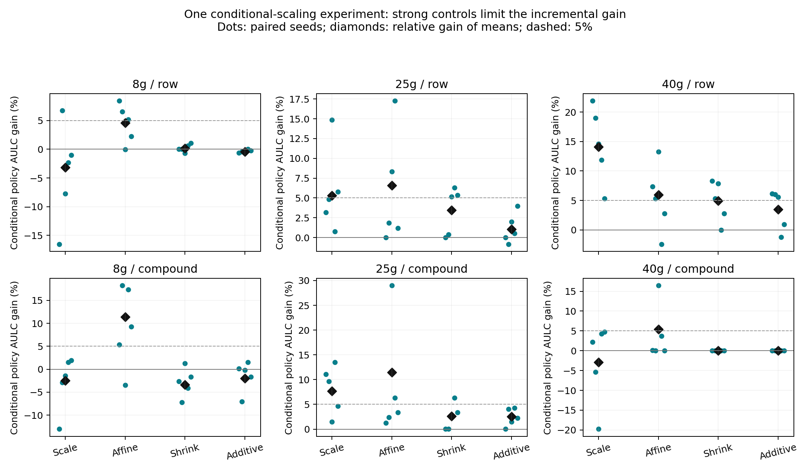

# Next Model Decision

**`STRUCTURED_FAILURE_BUT_NO_MATERIAL_MODEL_GAIN`**。识别了可复现的 EA/V1 条件结构，并完成一个 Conditional Scaling 实验；目前没有达到预先定义的跨场景 material gain，停止本轮模型扩展。

## 选择的模型与对照

模型：`target/(mass_ratio*S) = a*u+b+gamma*standardize_train(u*(EA-mean_train(EA)))`，u=source_q50/S。第三项真正改变 EA-dependent slope。对照只把第三项改成标准化 EA，即同参数数量的 additive control。两者每个输出三个参数、相同 lambda={0,0.1,1}、相同 train/validation、相同数值目标。

同时报告 standalone conditional/additive 和两个对称 validation policies；policy 可回退到 scale、affine、原 local identity shrinkage。两输出共用 validation 选择的 penalty，避免隐藏 V2 回归。Head-only 复用原 frozen neural reference。每个模型仍只消耗原单柱 actual_budget（train+validation），没有借用其他柱 target 标签，也没有使用配对 source 真值作为预测输入。

## 结果与停止依据

- 25g conditional policy 的 AULC 相对 scale 改善 row 5.32%、compound 7.68%，相对 affine 6.59%/11.43%。但相对 local shrinkage 仅 3.48%/2.62%，相对 additive policy 仅 1.04%/2.56%。有稳定方向性收益，但增量未达 5%。
- 40g row 相对 scale 改善 14.09%，相对 local shrinkage 4.97%、additive policy 3.47%。40g compound 的 validation policy 在全部 20 个 seed/budget contexts 都回退到 affine/shrinkage，实际与 local/additive policy 数值等价。保留原始配对值，另外给出 1e-7 AULC 数值 ties，避免把浮点差当成 seed wins。
- 8g 相对 scale/head/shrinkage 没有稳定优势。

**不能隐藏 standalone 的局部正信号：** 40g compound 的 standalone conditional AULC 为 3.4170，相对 scale 改善 5.12%，相对 local/additive policy 改善 7.76%，均赢 5/5 seeds。可是 40g row 相对 additive policy 只有 4.50%；25g 相对强对照也未达门槛；8g 没有收益。因而未达到预定的“两个 compound columns，或一个 column 的 row+compound 均超过所有强对照”的门槛。不能事后依据 test 撤销 policy fallback、选择 standalone 为主策略或调整 validation。该分歧记录为低标签 validation 可靠性的未来问题。

**High-budget absolute accuracy 没有实质解决。** budget 100，25g conditional policy 的 compound RMSE 为 13.10/19.67 mL，相对原 affine 14.14/20.13 有限改善；row 为 17.89/25.43。40g compound policy 仍为 33.57/40.97；standalone 40g compound 的 NRMSE 仅比 affine 改善 0.95%。这不是已经解决 25g/40g absolute error。完整 R²/RMSE/MAE 及各 seed 见下表/CSV。

最终主策略门槛：label efficiency=False；high-budget accuracy=False。局部 AULC 改善与跨场景 `LABEL_EFFICIENCY_GAIN`、`ACCURACY_GAIN` 必须分开说，不能用单个 column/seed/budget 推动继续复杂化。

## Paired AULC：主策略 versus 全部必要参考

| column | protocol | reference | relative_gain_percent | median_delta | std_delta | wins | wins_beyond_1e_7_aulc | numerical_ties_within_1e_7 | material |
| --- | --- | --- | --- | --- | --- | --- | --- | --- | --- |
| 25g | compound | scale_only | 7.68498873 | -0.119343875 | 0.0757157411 | 5 | 5 | 0 | True |
| 25g | compound | affine | 11.4253308 | -0.0548548104 | 0.31738275 | 5 | 5 | 0 | True |
| 25g | compound | local_identity_shrinkage | 2.61691411 | -0.0500790914 | 0.0401675374 | 5 | 5 | 0 | False |
| 25g | compound | target_head_only | 51.3476191 | -1.60886296 | 0.35028454 | 5 | NA | NA | True |
| 25g | compound | additive_policy | 2.55903928 | -0.0358796778 | 0.0277137854 | 5 | 5 | 0 | False |
| 25g | row | scale_only | 5.31791499 | -0.0937687087 | 0.0856274388 | 5 | 5 | 0 | True |
| 25g | row | affine | 6.59480605 | -0.0344396152 | 0.209385045 | 4 | 4 | 1 | True |
| 25g | row | local_identity_shrinkage | 3.48052436 | -0.0775293941 | 0.0681275648 | 4 | 4 | 1 | False |
| 25g | row | target_head_only | 42.2247693 | -1.47500986 | 0.125417854 | 5 | NA | NA | True |
| 25g | row | additive_policy | 1.04419988 | -0.0122563569 | 0.0355657775 | 3 | 3 | 1 | False |
| 40g | compound | scale_only | -2.86784404 | -0.0881574756 | 0.391858788 | 3 | 3 | 0 | False |
| 40g | compound | affine | 5.39791815 | -0.00369168648 | 0.394123134 | 3 | 3 | 2 | False |
| 40g | compound | local_identity_shrinkage | 2.44790799e-07 | -1.509546e-08 | 3.02975405e-08 | 4 | 0 | 5 | False |
| 40g | compound | target_head_only | 52.0084041 | -4.12482736 | 0.705077306 | 5 | NA | NA | True |
| 40g | compound | additive_policy | 0 | 0 | 0 | 0 | 0 | 5 | False |
| 40g | row | scale_only | 14.0856245 | -0.591305884 | 0.207519765 | 5 | 5 | 0 | True |
| 40g | row | affine | 5.94126701 | -0.142498713 | 0.24582891 | 4 | 4 | 0 | True |
| 40g | row | local_identity_shrinkage | 4.97059805 | -0.142498725 | 0.126065407 | 5 | 4 | 1 | False |
| 40g | row | target_head_only | 60.7895425 | -4.34945653 | 0.826077261 | 5 | NA | NA | True |
| 40g | row | additive_policy | 3.46637742 | -0.162691241 | 0.107660292 | 4 | 4 | 0 | False |
| 8g | compound | scale_only | -2.44174326 | 0.00756167735 | 0.0379853176 | 2 | 2 | 0 | False |
| 8g | compound | affine | 11.4407636 | -0.0808893595 | 0.100613844 | 4 | 4 | 0 | True |
| 8g | compound | local_identity_shrinkage | -3.3883262 | 0.0171755759 | 0.0299977595 | 1 | 1 | 0 | False |
| 8g | compound | target_head_only | -3.83803427 | -0.0432337707 | 0.178515003 | 3 | NA | NA | False |
| 8g | compound | additive_policy | -2.01395452 | 0.00111736572 | 0.0331554591 | 2 | 2 | 0 | False |
| 8g | row | scale_only | -3.19181923 | 0.014456999 | 0.0622503504 | 1 | 1 | 0 | False |
| 8g | row | affine | 4.58576476 | -0.034453691 | 0.0289952863 | 4 | 4 | 0 | False |
| 8g | row | local_identity_shrinkage | 0.169216633 | 7.35489825e-09 | 0.00491565876 | 2 | 2 | 2 | False |
| 8g | row | target_head_only | -10.8933939 | 0.121213105 | 0.112015554 | 1 | NA | NA | False |
| 8g | row | additive_policy | -0.421133749 | 0.00402590067 | 0.00225028907 | 0 | 0 | 1 | False |

## 全方法 seed stability

| column | protocol | method | mean | std | median | min | max |
| --- | --- | --- | --- | --- | --- | --- | --- |
| 25g | compound | additive_EA_control | 1.49004535 | 0.334089215 | 1.59355058 | 0.941429431 | 1.82602506 |
| 25g | compound | additive_policy | 1.52287388 | 0.351748153 | 1.61159214 | 0.956854105 | 1.88272535 |
| 25g | compound | affine | 1.67531299 | 0.594080973 | 1.63056727 | 0.96854132 | 2.61138909 |
| 25g | compound | conditional_EA | 1.47868937 | 0.332715177 | 1.57571246 | 0.952672539 | 1.83277546 |
| 25g | compound | conditional_policy | 1.48390294 | 0.337044293 | 1.57571246 | 0.956777725 | 1.85473813 |
| 25g | compound | local_identity_shrinkage | 1.52377892 | 0.350564284 | 1.63056726 | 0.956854104 | 1.90481722 |
| 25g | compound | scale_only | 1.60743406 | 0.316738236 | 1.65288829 | 1.0761216 | 1.88272535 |
| 25g | compound | target_head_only | 3.05001093 | 0.60502205 | 3.22418488 | 2.03168044 | 3.50267566 |
| 25g | row | additive_EA_control | 1.98039398 | 0.398741285 | 1.93396027 | 1.45361532 | 2.53111452 |
| 25g | row | additive_policy | 1.97114737 | 0.370608774 | 1.93396027 | 1.45361532 | 2.41262376 |
| 25g | row | affine | 2.08828285 | 0.513163875 | 1.8793842 | 1.55469034 | 2.90199432 |
| 25g | row | conditional_EA | 1.96637294 | 0.411851798 | 1.85675216 | 1.42479788 | 2.52544023 |
| 25g | row | conditional_policy | 1.95056465 | 0.379093734 | 1.85675216 | 1.42479788 | 2.40036741 |
| 25g | row | local_identity_shrinkage | 2.02090266 | 0.398857598 | 1.9616851 | 1.50232727 | 2.56231787 |
| 25g | row | scale_only | 2.06012008 | 0.299165715 | 1.97067375 | 1.67359826 | 2.41861304 |
| 25g | row | target_head_only | 3.37612611 | 0.422782217 | 3.30871162 | 2.91337064 | 3.90842994 |
| 40g | compound | additive_EA_control | 3.63080348 | 0.599774638 | 3.81576655 | 3.03217049 | 4.43825208 |
| 40g | compound | additive_policy | 3.70447486 | 0.620122342 | 3.78231553 | 3.05347074 | 4.61861025 |
| 40g | compound | affine | 3.9158492 | 0.980110061 | 3.86522213 | 3.05347069 | 5.5260677 |
| 40g | compound | conditional_EA | 3.41695885 | 0.409064891 | 3.56053959 | 2.95241561 | 3.84264138 |
| 40g | compound | conditional_policy | 3.70447486 | 0.620122342 | 3.78231553 | 3.05347074 | 4.61861025 |
| 40g | compound | local_identity_shrinkage | 3.70447487 | 0.620122353 | 3.78231554 | 3.0534707 | 4.61861026 |
| 40g | compound | scale_only | 3.60119812 | 0.440966467 | 3.85624433 | 3.04285593 | 3.95179335 |
| 40g | compound | target_head_only | 7.71900745 | 0.389243828 | 7.9863578 | 7.14898782 | 7.99846317 |
| 40g | row | additive_EA_control | 3.21544565 | 0.745492488 | 2.68945113 | 2.66714629 | 4.14861572 |
| 40g | row | additive_policy | 3.23501214 | 0.728609983 | 2.7653865 | 2.66714629 | 4.14861572 |
| 40g | row | affine | 3.32013233 | 0.868683733 | 2.73303461 | 2.6692586 | 4.517427 |
| 40g | row | conditional_EA | 3.08948941 | 0.735151998 | 2.63213848 | 2.50292097 | 3.91767937 |
| 40g | row | conditional_policy | 3.12287441 | 0.712635673 | 2.79906346 | 2.50292097 | 3.91767937 |
| 40g | row | local_identity_shrinkage | 3.28621915 | 0.765118028 | 2.79906346 | 2.66925861 | 4.25306398 |
| 40g | row | scale_only | 3.63486831 | 0.665990914 | 3.20555847 | 3.11806577 | 4.58824409 |
| 40g | row | target_head_only | 7.96439166 | 1.12202577 | 8.21740488 | 6.77543614 | 9.46306517 |
| 8g | compound | additive_EA_control | 0.72950254 | 0.185376251 | 0.672810317 | 0.536229414 | 1.02348474 |
| 8g | compound | additive_policy | 0.737971388 | 0.181199863 | 0.681312052 | 0.534737478 | 1.02348474 |
| 8g | compound | affine | 0.850090658 | 0.304561943 | 0.811644277 | 0.517879698 | 1.33989843 |
| 8g | compound | conditional_EA | 0.752303886 | 0.214309642 | 0.672746621 | 0.528834285 | 1.09578385 |
| 8g | compound | conditional_policy | 0.752833796 | 0.211448562 | 0.674147086 | 0.535854844 | 1.09578385 |
| 8g | compound | local_identity_shrinkage | 0.728161315 | 0.183770609 | 0.65697151 | 0.542724254 | 1.02208564 |
| 8g | compound | scale_only | 0.734889677 | 0.211296843 | 0.681312023 | 0.528293167 | 1.06533692 |
| 8g | compound | target_head_only | 0.72500775 | 0.0836987042 | 0.770599806 | 0.579088615 | 0.773965867 |
| 8g | row | additive_EA_control | 0.751962595 | 0.0888736198 | 0.744175536 | 0.642375976 | 0.886876959 |
| 8g | row | additive_policy | 0.749786359 | 0.0920458829 | 0.736369806 | 0.631471229 | 0.886876959 |
| 8g | row | affine | 0.789131686 | 0.104427666 | 0.773612253 | 0.66592492 | 0.953310967 |
| 8g | row | conditional_EA | 0.754925595 | 0.102464507 | 0.766920304 | 0.603587951 | 0.890442311 |
| 8g | row | conditional_policy | 0.752943963 | 0.0934761548 | 0.738068081 | 0.631471229 | 0.89090286 |
| 8g | row | local_identity_shrinkage | 0.754220229 | 0.0916786918 | 0.745809931 | 0.635478055 | 0.890902853 |
| 8g | row | scale_only | 0.729654704 | 0.1362811 | 0.718436968 | 0.61701423 | 0.955268656 |
| 8g | row | target_head_only | 0.678979997 | 0.113004129 | 0.652608607 | 0.538254952 | 0.825467811 |

## Budget 100 点指标（五 seeds 均值）

| column | protocol | method | V1_r2 | V1_rmse | V1_mae | V2_r2 | V2_rmse | V2_mae | normalized_rmse |
| --- | --- | --- | --- | --- | --- | --- | --- | --- | --- |
| 25g | compound | additive_EA_control | 0.857047448 | 13.2969137 | 8.51042132 | 0.878328684 | 19.7293761 | 12.5637268 | 1.45735812 |
| 25g | compound | additive_policy | 0.844371704 | 13.8411634 | 9.09025922 | 0.87964874 | 19.628572 | 13.0042844 | 1.4887581 |
| 25g | compound | affine | 0.836770811 | 14.1437998 | 8.84463892 | 0.872567103 | 20.1297115 | 12.6080769 | 1.52354782 |
| 25g | compound | conditional_EA | 0.8635054 | 13.0070124 | 8.1719128 | 0.877693773 | 19.7587501 | 12.8206979 | 1.43987615 |
| 25g | compound | conditional_policy | 0.860839963 | 13.0978551 | 8.26838746 | 0.878981009 | 19.6717391 | 12.7759827 | 1.44293437 |
| 25g | compound | local_identity_shrinkage | 0.841729036 | 13.9518854 | 8.90875243 | 0.877833418 | 19.7581037 | 12.4900954 | 1.49981251 |
| 25g | compound | scale_only | 0.822533722 | 14.7586126 | 10.3311545 | 0.856383991 | 21.3405612 | 15.0078261 | 1.60021945 |
| 25g | compound | target_head_only | 0.483927452 | 25.3517097 | 14.5006417 | 0.335982835 | 46.0397653 | 28.9216564 | 3.04057619 |
| 25g | row | additive_EA_control | 0.763948518 | 17.9515191 | 9.41654486 | 0.809429332 | 25.6815079 | 15.2022773 | 1.93783279 |
| 25g | row | additive_policy | 0.759807566 | 18.1077494 | 9.52586009 | 0.807842752 | 25.7986763 | 15.2943879 | 1.9513904 |
| 25g | row | affine | 0.746508321 | 18.6082205 | 9.71050769 | 0.816426673 | 25.2226077 | 14.3620431 | 1.96523109 |
| 25g | row | conditional_EA | 0.768268694 | 17.7823831 | 9.13158314 | 0.814612113 | 25.2976056 | 15.0366714 | 1.9151605 |
| 25g | row | conditional_policy | 0.765509248 | 17.8858631 | 9.28290534 | 0.812855257 | 25.4275076 | 15.1544809 | 1.92576689 |
| 25g | row | local_identity_shrinkage | 0.746422364 | 18.6123694 | 9.91575478 | 0.811642996 | 25.5261753 | 15.1517525 | 1.9749357 |
| 25g | row | scale_only | 0.737948806 | 18.8817811 | 10.6871391 | 0.791517025 | 26.8216001 | 15.8154919 | 2.03232046 |
| 25g | row | target_head_only | 0.411279517 | 28.2771172 | 16.0440159 | 0.270070207 | 50.3619845 | 30.6782405 | 3.36063307 |
| 40g | compound | additive_EA_control | 0.756095116 | 32.1143882 | 19.3480293 | 0.763226529 | 43.8798553 | 28.905624 | 3.40252276 |
| 40g | compound | additive_policy | 0.732092814 | 33.5744583 | 20.0755744 | 0.791624058 | 40.9652485 | 23.0829019 | 3.40452281 |
| 40g | compound | affine | 0.732092815 | 33.5744582 | 20.0755742 | 0.791624055 | 40.9652489 | 23.0829021 | 3.40452282 |
| 40g | compound | conditional_EA | 0.759812894 | 31.84472 | 18.6400821 | 0.767587238 | 43.4552393 | 28.4332276 | 3.37220499 |
| 40g | compound | conditional_policy | 0.732092814 | 33.5744583 | 20.0755744 | 0.791624058 | 40.9652485 | 23.0829019 | 3.40452281 |
| 40g | compound | local_identity_shrinkage | 0.732092814 | 33.5744583 | 20.0755743 | 0.791624055 | 40.9652489 | 23.082902 | 3.40452282 |
| 40g | compound | scale_only | 0.715105317 | 34.7390702 | 24.3340597 | 0.774938119 | 42.7094038 | 28.5145868 | 3.53266817 |
| 40g | compound | target_head_only | -0.169431673 | 70.985732 | 47.326328 | -0.261411375 | 102.751069 | 71.6015569 | 7.70005533 |
| 40g | row | additive_EA_control | 0.802046713 | 31.2822959 | 18.6702172 | 0.849482481 | 37.2449056 | 21.1944795 | 3.14336732 |
| 40g | row | additive_policy | 0.802046713 | 31.2822959 | 18.6702172 | 0.849482481 | 37.2449056 | 21.1944795 | 3.14336732 |
| 40g | row | affine | 0.791185708 | 32.0110551 | 18.8613486 | 0.85100921 | 37.0238547 | 20.6804159 | 3.18273543 |
| 40g | row | conditional_EA | 0.816767903 | 29.9863644 | 17.3106206 | 0.857250542 | 36.190622 | 20.7115505 | 3.02834504 |
| 40g | row | conditional_policy | 0.808817439 | 30.5211728 | 18.0184449 | 0.856864419 | 36.2352148 | 20.7014525 | 3.06366794 |
| 40g | row | local_identity_shrinkage | 0.779221618 | 32.9108217 | 19.9986015 | 0.850403158 | 37.0609797 | 20.6929087 | 3.24098432 |
| 40g | row | scale_only | 0.743871923 | 35.4278899 | 24.6393799 | 0.803438868 | 42.6606947 | 28.5279499 | 3.57486197 |
| 40g | row | target_head_only | -0.0826711366 | 73.4771817 | 46.4122625 | -0.178794124 | 105.724222 | 71.1574211 | 7.95061795 |
| 8g | compound | additive_EA_control | 0.878738046 | 5.94131127 | 3.15408075 | 0.909534161 | 8.5913802 | 4.74149748 | 0.644205976 |
| 8g | compound | additive_policy | 0.877930348 | 5.96321623 | 3.23524424 | 0.90406142 | 8.91071668 | 4.7250636 | 0.655527718 |
| 8g | compound | affine | 0.804183626 | 7.39319806 | 3.88424684 | 0.899444814 | 9.17605206 | 4.72780545 | 0.754518801 |
| 8g | compound | conditional_EA | 0.872020474 | 6.10470128 | 3.16784476 | 0.909308186 | 8.63632362 | 4.75356194 | 0.655971609 |
| 8g | compound | conditional_policy | 0.869496768 | 6.16363367 | 3.38365287 | 0.90829358 | 8.76529107 | 4.55241655 | 0.663722188 |
| 8g | compound | local_identity_shrinkage | 0.876619764 | 5.99423034 | 3.25531751 | 0.909457919 | 8.59407834 | 4.7462885 | 0.647647847 |
| 8g | compound | scale_only | 0.853161546 | 6.5302189 | 3.78195963 | 0.9090831 | 8.72036909 | 4.56068992 | 0.685586548 |
| 8g | compound | target_head_only | 0.882364372 | 5.85147673 | 3.04107529 | 0.886658567 | 9.88319044 | 4.70007943 | 0.678682519 |
| 8g | row | additive_EA_control | 0.851280128 | 6.45662264 | 3.56743855 | 0.869983739 | 9.39662078 | 5.56401512 | 0.701948824 |
| 8g | row | additive_policy | 0.85104921 | 6.46151725 | 3.54837635 | 0.869981815 | 9.39648653 | 5.55743352 | 0.702255234 |
| 8g | row | affine | 0.842078527 | 6.6066767 | 3.56043672 | 0.86721644 | 9.49291375 | 5.64921101 | 0.714465268 |
| 8g | row | conditional_EA | 0.849217895 | 6.51308882 | 3.4665794 | 0.869330926 | 9.42061488 | 5.55090897 | 0.706278106 |
| 8g | row | conditional_policy | 0.849165641 | 6.51301746 | 3.54785255 | 0.86959151 | 9.41109589 | 5.56360627 | 0.705977526 |
| 8g | row | local_identity_shrinkage | 0.850606799 | 6.47345125 | 3.54957387 | 0.868345082 | 9.46017794 | 5.63623111 | 0.704993385 |
| 8g | row | scale_only | 0.852852013 | 6.19854078 | 3.82488382 | 0.874623506 | 9.24361438 | 5.51975048 | 0.680813669 |
| 8g | row | target_head_only | 0.863370088 | 6.06985454 | 3.34305143 | 0.878758554 | 9.12294668 | 5.29794852 | 0.668895025 |

## Validation policy choices

| column | protocol | conditional_policy | contexts |
| --- | --- | --- | --- |
| 25g | compound | affine | 3 |
| 25g | compound | conditional_EA | 14 |
| 25g | compound | scale_only | 3 |
| 25g | row | affine | 1 |
| 25g | row | conditional_EA | 13 |
| 25g | row | local_identity_shrinkage | 3 |
| 25g | row | scale_only | 3 |
| 40g | compound | affine | 5 |
| 40g | compound | local_identity_shrinkage | 15 |
| 40g | row | conditional_EA | 16 |
| 40g | row | local_identity_shrinkage | 4 |
| 8g | compound | affine | 2 |
| 8g | compound | conditional_EA | 6 |
| 8g | compound | local_identity_shrinkage | 1 |
| 8g | compound | scale_only | 11 |
| 8g | row | affine | 2 |
| 8g | row | conditional_EA | 7 |
| 8g | row | local_identity_shrinkage | 9 |
| 8g | row | scale_only | 2 |

## 可回答和不可回答的问题

训练审计足以进入 `CONDITIONAL_SCALING` 的一次受控试验；它不支持 `conditions 无用`。本轮对照又说明不能把主要瓶颈确定为 additive formulation：改变为 varying slope 的增益仍受估计方差、验证选择和强正则化对照限制。数据不支持这时再追加 MLP、molecule-dependent、paired/delta 或 readout 模型。

项目级历史结论保持 provenance，当前解释继续是 `NO_ADDITIONAL_COMPLEXITY_JUSTIFIED_FOR_TESTED_CALIBRATION_EXTENSIONS`。本轮识别了结构，所以不写 `NO_STRUCTURED_SCALING_FAILURE_IDENTIFIED`；也不宣称现有数据关闭了所有复杂模型研究空间。

B/C、multi-column / multi-condition、adaptive readout、noise floor、真正 source-unseen OOD、crossed mass×flow 继续放入 [科研 backlog](../../../docs/research/CROSS_COLUMN_TRANSFER_STATUS.md)。完整 paired source IDs 为将来设计留存；本轮没有后验放宽匹配规则或增加新方法。

## Artifacts and checks

- [Training-only evidence](training_direction_evidence.csv) / [frozen choice](training_direction_decision.json)
- [Model preregistration](MODEL_PREREGISTRATION.md) / [frozen protocol](model_protocol.json)
- [All seed/budget R², RMSE, MAE, NRMSE](model_all_metrics.csv)
- [Point metric mean/std/median/min/max](model_aggregate_metrics.csv)
- [Planned/actual-budget AULC](model_aulc_by_seed.csv)
- [All paired AULC comparisons](model_paired_aulc.csv) / [budget-100 comparisons](model_paired_budget100.csv)
- [Label usage](model_label_usage.csv) / [validation choices](model_selection.csv)
- [Execution audit](model_execution_audit.json): 120 contexts, 960 metric records, 0 unresolved model failures; all predictions frozen before test.

历史 test 已被使用过，因此本轮是开发性证据。source/q50 和 label roles 复用原协议；未训练 QGeoGNN，未改变 qualified baseline。描述性 test 汇总不能重开训练筛选或改变预定方法。
