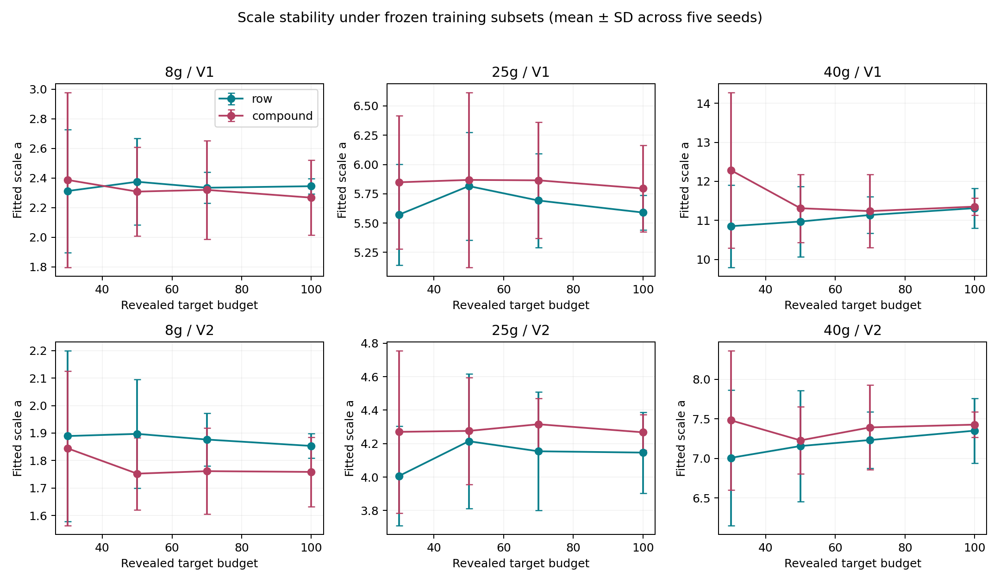
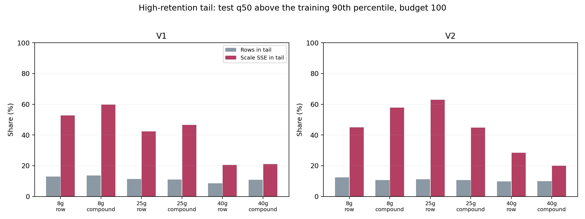
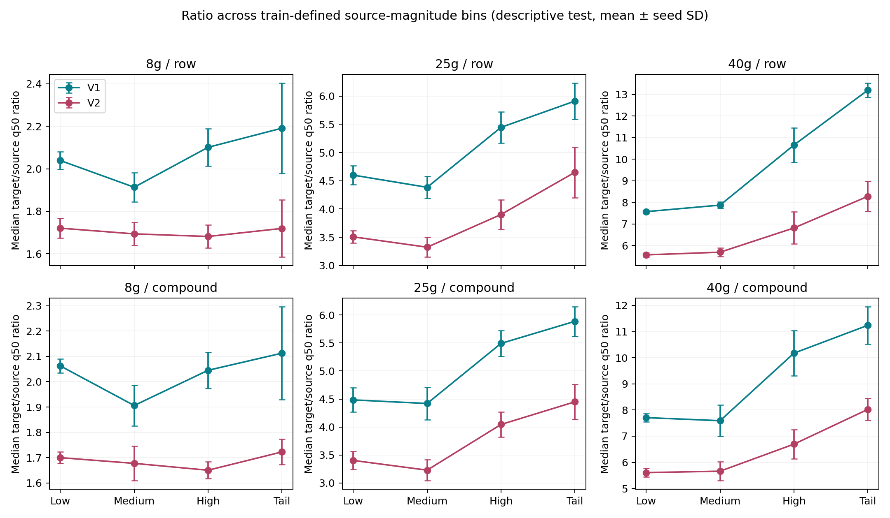
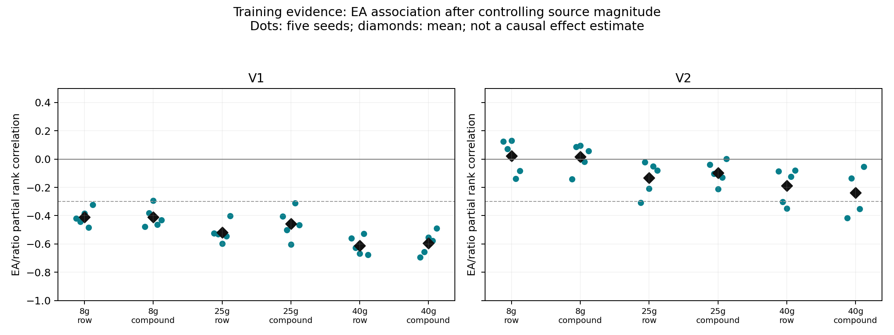
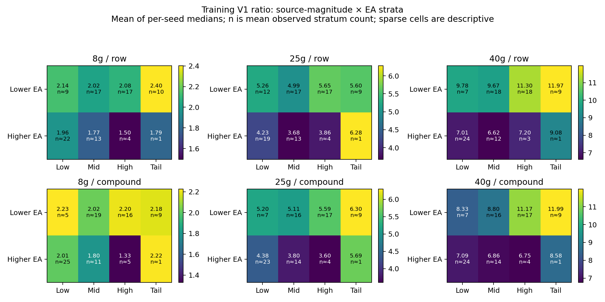
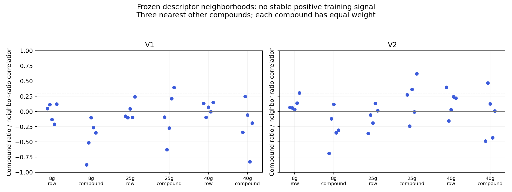
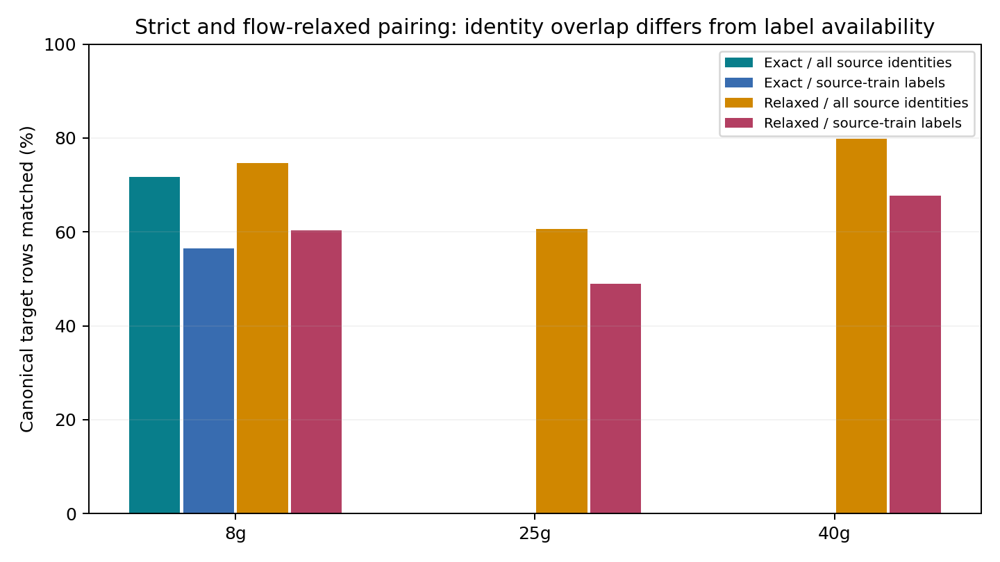

# Scaling Failure Audit

**发现了结构化失败，但不能将强 scale-only 解释成普适物理规律。** 训练内预设筛选只支持进入 `CONDITIONAL_SCALING`：V1 的 ratio 与 EA 比例存在跨三个柱、row/compound 均复现的关系。随后完成一个条件缩放实验，其主策略未通过相对强对照的 material-gain 门槛。详见 [NEXT_MODEL_DECISION.md](NEXT_MODEL_DECISION.md)。

## A. Scale-only 参数是否稳定？

答案是有条件的稳定。budget 100 时，25g/40g 的跨 seed scale CV 为 1.9%–6.4%；8g row 为 2.2%–2.4%，8g compound V1 则为 11.1%。budget 30 的 CV 达 7.4%–24.8%。因此不能用一个“不稳定/稳定”概括所有预算和协议。

更关键的是 `a = sum(x*y)/sum(x²) = sum(w_i * ratio_i)`，其中 `w_i=x_i²/sum(x²)`。这是一种 **source-q50 平方加权的 ratio 平均**，不是平均样本的 ratio。训练上端 10% q50 样本占 46%–70% 的平均 x² 权重；删除这部分训练范围后，25g/40g 的 scale 均值改变约 -7% 到 -13%。在固定采样分布下跨 seed 较稳定，并不等于对 source 范围或条件分布稳定。

| column | protocol | target | mean | std | median | min | max | cv_percent |
| --- | --- | --- | --- | --- | --- | --- | --- | --- |
| 25g | compound | V1 | 5.79512109 | 0.370854756 | 5.81269043 | 5.38350368 | 6.3735607 | 6.39943066 |
| 25g | compound | V2 | 4.26758657 | 0.106368874 | 4.20383899 | 4.19699315 | 4.44469431 | 2.49248311 |
| 25g | row | V1 | 5.58985486 | 0.147606615 | 5.49652305 | 5.46646449 | 5.78539964 | 2.64061624 |
| 25g | row | V2 | 4.14637775 | 0.242091156 | 4.11830788 | 3.86412134 | 4.41286838 | 5.83861795 |
| 40g | compound | V1 | 11.3525068 | 0.216943005 | 11.3672896 | 11.0303919 | 11.5541337 | 1.91097005 |
| 40g | compound | V2 | 7.42692093 | 0.161191297 | 7.37898329 | 7.26344754 | 7.6753681 | 2.17036506 |
| 40g | row | V1 | 11.3127997 | 0.513118441 | 11.1517779 | 10.7835978 | 12.0728449 | 4.53573344 |
| 40g | row | V2 | 7.3506096 | 0.409702049 | 7.34615995 | 6.77193511 | 7.75513374 | 5.57371525 |
| 8g | compound | V1 | 2.26742242 | 0.252130899 | 2.22088707 | 2.02628071 | 2.68705488 | 11.1197145 |
| 8g | compound | V2 | 1.7587534 | 0.125934638 | 1.74845993 | 1.6090096 | 1.9545875 | 7.16044886 |
| 8g | row | V1 | 2.34479365 | 0.0516024583 | 2.36968297 | 2.2561186 | 2.38289476 | 2.20072492 |
| 8g | row | V2 | 1.85327385 | 0.0443802288 | 1.83748266 | 1.80025571 | 1.90687008 | 2.39469352 |

[全部预算/seed 系数](scale_stability_by_seed.csv)保留 train compound 数、source 范围、尾部权重、leave-one-compound scale 与截去尾部后的变化；这只是训练子集敏感性分析，不用于挑模型。



## B. 残差/ratio 主要依赖什么？

**最可复现的条件信号是 EA fraction / V1；绝对误差还明显依赖 source magnitude 和柱规格。** 不能从这些观察性统计做唯一因果方差分解。

1. **Source magnitude / high-retention tail。** 使用各 seed 的 train q33/q67/q90 定义 low/medium/high/extreme tail，test 不重估边界。8g/25g 上约 11%–14% 的尾部行承担约 42%–63% 的 scale SSE；40g 尾部占约 8%–11% 行、约 20%–28% SSE，尾部 RMSE 虽大，但主体样本也有很大误差。不能把 40g 的问题归结为少数尾部点。尾部 signed error 方向也不是所有柱/协议一致。40g 的 ratio 与 source q50 的训练 Spearman 均值约 0.38–0.48；8g 接近零。ratio 的分母/source predictor error 可能产生耦合，不能直接解释成真实曲率。

| column | protocol | target | tail_row_fraction | tail_sse_fraction | tail_rmse | rest_rmse | tail_signed_mean |
| --- | --- | --- | --- | --- | --- | --- | --- |
| 25g | compound | V1 | 0.110617074 | 0.464956882 | 30.0779408 | 11.1442194 | 9.66607831 |
| 25g | compound | V2 | 0.106995837 | 0.4478004 | 43.0116094 | 16.0532526 | 15.0666622 |
| 25g | row | V1 | 0.114285714 | 0.423497302 | 38.4961092 | 14.5992719 | 11.9708385 |
| 25g | row | V2 | 0.112244898 | 0.628476149 | 70.6886425 | 16.896932 | 33.1352292 |
| 40g | compound | V1 | 0.10872353 | 0.211164794 | 45.8421201 | 32.7543831 | -0.446565298 |
| 40g | compound | V2 | 0.0988602705 | 0.199663731 | 55.4651727 | 40.3481349 | 17.9310671 |
| 40g | row | V1 | 0.0849056604 | 0.204389315 | 54.6446558 | 32.8853532 | 31.8216554 |
| 40g | row | V2 | 0.0981132075 | 0.284323959 | 69.091218 | 37.8239814 | 35.995703 |
| 8g | compound | V1 | 0.136701424 | 0.596551962 | 14.0800253 | 4.32838961 | -1.28892096 |
| 8g | compound | V2 | 0.107402394 | 0.578470301 | 19.7007167 | 5.92237154 | 0.128749922 |
| 8g | row | V1 | 0.128695652 | 0.527610063 | 13.1776741 | 4.44769899 | -4.23796287 |
| 8g | row | V2 | 0.123478261 | 0.44903132 | 19.7390261 | 7.23289036 | -7.40481037 |




2. **Conditions。** 控制 source magnitude 后，EA fraction 与 V1 ratio 的平均 partial rank rho 在六个场景为 -0.41 至 -0.61；再控制 compound 后约 -0.57 至 -0.79。共同 source-bin 支持下，较高 EA 的相对 ratio contrast 约 -20% 至 -42%。V2 信号较弱。每个条件都同时有原类别分箱、source×condition 交互分箱和 common-support 标准化汇总，绝非只算相关系数。loading solvent、上样体积/实际量、加载溶剂体积没有通过同样的跨 seed 门槛；其中不少特征在部分柱内近乎常量、与 molecule 混杂或缺少共同支持，这不等于无效。

| column | protocol | target | ratio_partial_source_rho | ratio_partial_source_compound_rho | relative_standardized_contrast |
| --- | --- | --- | --- | --- | --- |
| 25g | compound | V1 | -0.457388133 | -0.618427526 | -0.350496761 |
| 25g | compound | V2 | -0.0960176162 | -0.299979151 | -0.0112077426 |
| 25g | row | V1 | -0.519256863 | -0.595596648 | -0.288465033 |
| 25g | row | V2 | -0.133010644 | -0.167308834 | -0.0698305941 |
| 40g | compound | V1 | -0.593965367 | -0.721885646 | -0.410626347 |
| 40g | compound | V2 | -0.237510416 | -0.25729248 | -0.0952272379 |
| 40g | row | V1 | -0.611419449 | -0.791523373 | -0.419137674 |
| 40g | row | V2 | -0.188221832 | -0.435083148 | -0.135275183 |
| 8g | compound | V1 | -0.409400096 | -0.565306494 | -0.254464717 |
| 8g | compound | V2 | 0.0166781563 | -0.261435065 | -0.0386150683 |
| 8g | row | V1 | -0.410558275 | -0.582981943 | -0.195134377 |
| 8g | row | V2 | 0.0211946798 | -0.43386106 | -0.0581425836 |

标准化汇总仅在同一 source bin 中两组各至少 3 行、2 个 compound 且至少两个 bin 可比较时计算。它是观察数据的 support-restricted summary，不是替换实验条件后的 counterfactual partial dependence。rho 调整也不能消除所有非线性混杂。




3. **Molecule。** 已记录每个 compound 的 mean/median ratio、ratio variance、OOF residual variance、不同 EA 条件数及 residual sign consistency。七个可审计 RDKit descriptor 的 compound-level 关联和 3-nearest-neighbor 检查没有稳定复现的正邻域信号；low/high-EA 两半的 compound scaling 一致性也较弱。部分 compound 可表现系统偏高/偏低，但没有足够证据证明这在所测 descriptor 空间可泛化。row 低标签训练中每个 compound 往往不足四行，条件两半比较常为不可估计；报告 NaN，不填零。这里使用 descriptor-space，未把它冒称 QGeoGNN latent space，也未排除后者可能有结构。

| column | protocol | target | neighbor_rho | neighbor_scale_residual_rho | condition_halves_rho | condition_halves_compounds | source_error_partial_rho |
| --- | --- | --- | --- | --- | --- | --- | --- |
| 25g | compound | V1 | -0.0782831677 | -0.222629386 | 0.292967033 | 13.8 | NA |
| 25g | compound | V2 | 0.202450335 | -0.156162123 | 0.348571429 | 13.8 | NA |
| 25g | row | V1 | 0.00237993517 | 0.0030968889 | NA | 2 | NA |
| 25g | row | V2 | -0.0931716749 | -0.134559382 | NA | 2 | NA |
| 40g | compound | V1 | -0.233021451 | -0.223666905 | 0.251208791 | 13.6 | NA |
| 40g | compound | V2 | -0.0639375835 | -0.228908731 | 0.262857143 | 13.6 | NA |
| 40g | row | V1 | 0.0502680904 | 0.0654051625 | NA | 1 | NA |
| 40g | row | V2 | 0.146156392 | 0.0278739538 | NA | 1 | NA |
| 8g | compound | V1 | -0.420860119 | -0.444332247 | 0.0773626374 | 13.4 | 0.295613355 |
| 8g | compound | V2 | -0.269561955 | -0.109930277 | 0.225714286 | 13.4 | 0.182198563 |
| 8g | row | V1 | -0.0115850455 | 0.0277809226 | NA | 1.8 | 0.233696531 |
| 8g | row | V2 | 0.121277866 | 0.05202244 | NA | 1.8 | 0.205940221 |



4. **Pair status。** 8g 的配对/条件不同两组误差有差异，但方向随 output/protocol 变化。例如 V1 的 row 配对 RMSE 较小，compound 配对 RMSE 反而较大。两组同时有 molecule 和 source-range 组成差异，不能把误差差异归因于配对本身。source-absent 仅 8g 一个 compound/7 行、25g 一个 compound/19 行、40g 零行；分组表记录非空 seed 数，不能把这些小组宣布为 source-unseen OOD 性能。

## 严格配对与 relaxed pairing

exact 只允许柱规格不同，其余匹配字段为 canonical molecule、精确有理数 PE/EA 组成、loading solvent、density 和 sample volume、loading-solvent volume、flow。density 和 volume 分别相等比仅比较它们的乘积更严格。relaxed 只再忽略 flow，未使用容差、最近邻或过宽 matching。

| column | rows | exact_rows | relaxed_rows | exact_source_train_rows | relaxed_source_train_rows | ambiguous_exact_source_rows | source_absent_rows |
| --- | --- | --- | --- | --- | --- | --- | --- |
| 25g | 490 | 0 | 297 | 0 | 240 | 0 | 19 |
| 40g | 529 | 0 | 422 | 0 | 358 | 0 | 0 |
| 8g | 574 | 412 | 429 | 324 | 346 | 0 | 7 |

历史 8g exact overlap 483 行没有检查 density；本轮严格口径为 412 行（71.8%），其中 324 行（56.4%）有原 source-train 标签可用。不能把 source validation/test 标签当成免费模型输入。25g/40g 严格 exact 为零，因为 flow 不同；relaxed 为 297/490（60.6%）、422/529（79.8%），source-train 可用分别为 240、358 行。完整匹配源 IDs 与匹配数在 [pair_identity_audit.csv](pair_identity_audit.csv)，source-train 标签特征只来自源训练集合。

8g 的 source-error anchor 与 OOF scale residual 在训练中的平均 partial rho 约 0.18–0.30，跨 seed 波动大；配对数量足够，但信号未在 row+compound 各达到 4/5 seeds，故本轮不运行 paired/delta 模型。25g/40g relaxed pairs 正式保留为 backlog，不能直接当作 flow 的因果对照。

| column | protocol | target | dimension | level | seeds_with_observations | mean_rows_when_present | mean_compounds_when_present | ratio_median | scale_rmse | scale_mae | affine_rmse | affine_mae |
| --- | --- | --- | --- | --- | --- | --- | --- | --- | --- | --- | --- | --- |
| 8g | compound | V1 | pair_status | exact_paired | 5 | 82 | 14.2 | 1.96724611 | 7.00759195 | 4.13344083 | 7.99642593 | 4.21883509 |
| 8g | compound | V1 | pair_status | same_compound_condition_different | 5 | 31.8 | 6.4 | 2.0964583 | 5.03171564 | 2.91494929 | 5.37136127 | 3.10502279 |
| 8g | compound | V1 | pair_status | source_absent | 1 | 7 | 1 | 2.16058162 | 1.35629319 | 1.17474419 | 1.28822635 | 0.887992012 |
| 8g | compound | V2 | pair_status | exact_paired | 5 | 82 | 14.2 | 1.66967892 | 8.31374984 | 4.36232799 | 8.89225985 | 4.54745841 |
| 8g | compound | V2 | pair_status | same_compound_condition_different | 5 | 31.8 | 6.4 | 1.75319017 | 8.97282069 | 5.23113539 | 9.21047052 | 5.42646874 |
| 8g | compound | V2 | pair_status | source_absent | 1 | 7 | 1 | 1.67313926 | 1.41902831 | 1.26507564 | 2.73579796 | 2.3984515 |
| 8g | row | V1 | pair_status | exact_paired | 5 | 83.2 | 51.6 | 2.0110612 | 5.75328118 | 3.82071696 | 6.28976111 | 3.54672839 |
| 8g | row | V1 | pair_status | same_compound_condition_different | 5 | 30.8 | 19.6 | 2.08789332 | 6.83111639 | 3.84523855 | 6.77446904 | 3.61747113 |
| 8g | row | V1 | pair_status | source_absent | 4 | 1.25 | 1 | 2.01975203 | 1.82835788 | 1.66736937 | 1.15558291 | 1.15081925 |
| 8g | row | V2 | pair_status | exact_paired | 5 | 83.2 | 51.6 | 1.68795159 | 7.4260906 | 4.88716156 | 7.53094604 | 4.86592063 |
| 8g | row | V2 | pair_status | same_compound_condition_different | 5 | 30.8 | 19.6 | 1.76289276 | 12.4745184 | 7.26007223 | 12.9680168 | 7.76349628 |
| 8g | row | V2 | pair_status | source_absent | 4 | 1.25 | 1 | 1.65582568 | 2.92227279 | 2.74265478 | 3.74861798 | 3.71450697 |

表中 rows/compounds 是**有观测的 seed 内均值**；请同时看 seeds_with_observations。完整 25g/40g relaxed 分组 RMSE/MAE/ratio 见 [pair_error_summary.csv](pair_error_summary.csv)。它包含每个 column、row/compound、V1/V2 的三类分组；无样本组不伪造零误差。



## C. Additive condition Ridge 的负结果意味着什么？

不能解释成 conditions 不重要。训练内 EA/V1 信号足以排除这种过强解释；但条件作用已部分被 source q50 压缩，ratio 分母耦合、拟合方差和条件/分子结构也会混入 residual。原结果仍应表述为 `ADDITIVE_LINEAR_CONDITION_RESIDUAL_NOT_MATERIALLY_SUPPORTED`。

本轮真正让 condition 进入 slope，并用同容量 additive-EA control 比较。conditional 在少数场景更好，但跨场景没有稳定超过强 additive/shrinkage controls 的 material 改善。因此证据**不能进一步证明 additive formulation 就是主要瓶颈，或 multiplicative formulation 已解决问题**。

## D/E. 是否进入模型方向，是否停止？

训练证据选择了一个方向：`CONDITIONAL_SCALING`，并已完成最小实验。B `MOLECULE_DEPENDENT_SCALING` 和 C `PAIRED_DELTA_LEARNING` 未过预设筛选，不执行。最终是 **`STRUCTURED_FAILURE_BUT_NO_MATERIAL_MODEL_GAIN`**；不能写 `NO_STRUCTURED_SCALING_FAILURE_IDENTIFIED`，因为 EA/V1 的稳定失败结构确实被发现。主策略既未达到跨场景 `LABEL_EFFICIENCY_GAIN`，也未达到 `ACCURACY_GAIN` 门槛。见 [模型决策](NEXT_MODEL_DECISION.md) 中 standalone 40g 信号与 validation 回退的完整区别。

## 证据边界、复现和数据需求

训练内方向选择使用各 frozen context 的 budget-100 gradient_train，并按 compound GroupKFold 得到 OOF residual。没有合并跨 seed 标签来拟合模型；这些 seeds 的样本仍重叠，不能当五个独立外部数据集。随后冻结 model protocol、全部 120 组预测，再读取本轮 target test。test 表仅用于描述/冻结门槛，未追加方法。所有 qualified predictor、原 splits、旧结果与 checkpoint 保留不变。

当前仅能称 `EMPIRICAL CROSS-COLUMN STRUCTURE`，不能称 `PHYSICAL LAW`。目标分子高度重叠 source；8g 条件大量匹配；25g/40g flow/条件范围不同；mass/flow/spec 混杂。相同条件重复行很少，且没有足够独立重复批次，无法估计 irreducible experimental noise：

| column | exact_replicate_groups | rows_in_exact_replicate_groups | max_replicates | source_V1_below_ratio_floor | source_V2_below_ratio_floor |
| --- | --- | --- | --- | --- | --- |
| 8g | 7 | 14 | 2 | 0 | 0 |
| 25g | 3 | 6 | 2 | 0 | 0 |
| 40g | 7 | 14 | 2 | 0 | 0 |

更有价值的数据是：独立 compound/实验批次的确认集、同条件重复实验、高 retention 尾部覆盖、source-unseen 分子，以及 crossed mass×flow。关于共享 backbone、column heads/context/task embedding、多任务、多保真、adaptive readout、paired/delta 等方向，继续以 [FUTURE_HYPOTHESES / EXPERIMENT_BACKLOG](../../../docs/research/CROSS_COLUMN_TRANSFER_STATUS.md) 保存。

按顺序执行（各阶段检查/写入同一协议文件，不并发运行）：

```bash
conda run --no-capture-output -n fish python scripts/studies/run_scaling_failure_audit.py --train-audit
conda run --no-capture-output -n fish python scripts/studies/run_conditional_scaling_audit_model.py --fit
conda run --no-capture-output -n fish python scripts/studies/run_conditional_scaling_audit_model.py --evaluate
conda run --no-capture-output -n fish python scripts/studies/run_scaling_failure_audit.py --test-descriptive
MPLCONFIGDIR=/tmp/scaling-failure-mpl conda run --no-capture-output -n fish python scripts/studies/summarize_scaling_failure_audit.py
```

依赖原 qualified checkpoint、source prediction cache（缺失时仅重新推理，不训练）及固定 conda fish 环境。输入/代码/设计哈希漂移会停止复用。详细 train/test bins、interaction、molecule、pairing、scaling stability、逐 seed/预算性能和 label ledgers 均在本目录 CSV/JSON 中。
