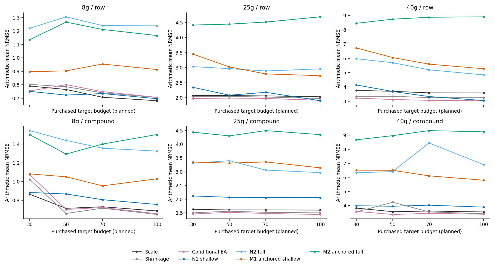
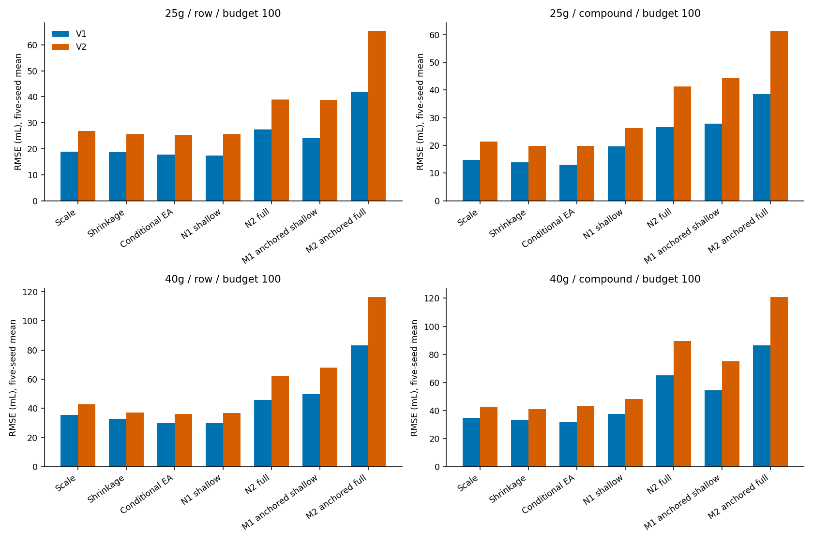
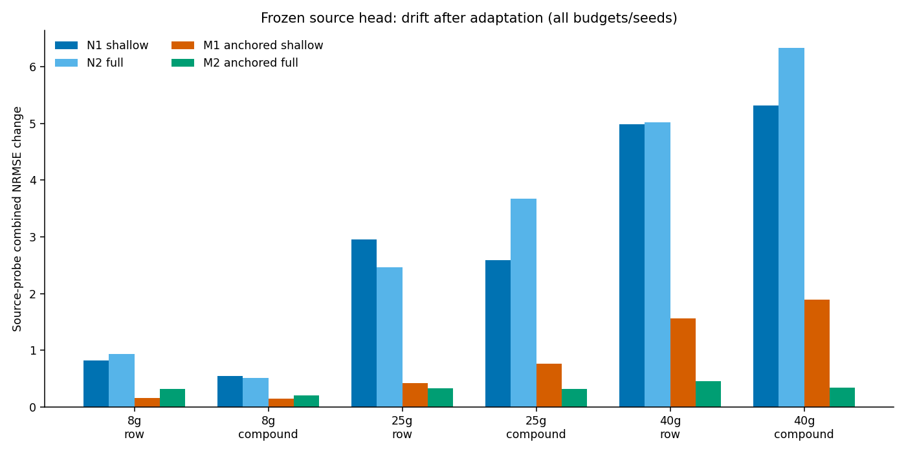
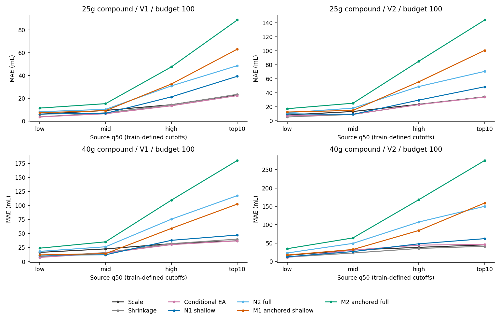

# Source-anchored shared representation transfer

本轮结论：**`CURRENT_QGEOGNN_REPRESENTATION_NOT_SUFFICIENT_FOR_LOW_LABEL_CROSS_COLUMN_TRANSFER`**。完整执行 3 柱 × 2 协议 × 5 seeds × 4 budgets，共 120 contexts、480 次新 neural fits；加上五个冻结参考方法，得到 1080 组点指标。全部预测先冻结，再执行本轮 test 评价。历史 test 已使用，因此这是 **developmental evidence**。

## 1. 为什么从 scalar 转向 representation

source q50 把 molecule 与 chromatography condition representation 压缩成每个输出的一个数。之前的 conditional、affine、shrinkage 和 spline 研究已接近收益递减。本轮直接迁移 128D latent representation，分别检验 H1（表示迁移的价值）与 H2（固定 source function 的 replay 约束是否有额外价值）。这不预设 information bottleneck 一定是主要误差来源。

这里比较的是有限标签与冻结训练配方下能学到的性能，不是单纯的函数表达能力：对正的 scale coefficient，原 head 的相应 weight/bias 同乘该系数就能表达 scale-only。因此即使 neural learner 较差，也不能据此证明 128D 中没有所需信息；若 fine-tuning 较好，也不能把所有收益唯一归因于原始 latent 中已有的信息。本轮没有据此追加 scaled-head 初始化或优化器实验。

历史结论 `NO_ADDITIONAL_COMPLEXITY_JUSTIFIED_FOR_TESTED_CALIBRATION_EXTENSIONS` 保留。本轮属于 representation-level transfer，不是新的 scalar correction。

## 2. 实际实现及 matched controls

| 方法 | 可训练部分 | 参数数 | source replay |
| --- | --- | ---: | --- |
| N1 standard_shallow_finetune | backbone.convs.4 + condition_branch + target_head | 36,387 | 无 |
| N2 standard_full_finetune | full backbone + condition_branch + target_head | 458,952 | 无 |
| M1 source_anchored_shallow | 与 N1 相同 | 36,387 | L_target + L_source |
| M2 source_anchored_full | 与 N2 相同 | 458,952 | L_target + L_source |

shared backbone 和两个独立 heads 均从 qualified final 4g row-seed-42 checkpoint 初始化。source head 固定，target head 不随机初始化；零步六输出与 source predictor 完全一致。head、loss、sum pooling、输入条件与 normalization 均未改。所有 wrapper 总参数 459,726（包含独立冻结的 774 个 source-head 参数）。N0 复用历史 frozen-backbone head-only，非本轮重新拟合。

原始 label IDs、row/compound splits 和嵌套 budgets 全部复用。每个模型只使用 4g source-train 与本柱购买标签。row 预算包含 8 个 validation labels；compound 按完整 compound 购买，实际预算见逐 context ledger。4g replay 不计入 target acquisition cost，但 draws、unique source IDs 单独报告。

Adam lr=1e-4、weight_decay=1e-5、最大 500 epochs、patience=100，checkpoint 只按 target-validation combined RMS NRMSE 选择。两个 task 使用原 raw-mL batch-mean loss、lambda=1。target pass 更新可训练 BN 的统计；source replay 固定 BN 统计并保留梯度，使 matched arms 不因额外 running-stat 更新而不同。

## 3. 完整结果

四种新方法都没有在任一场景同时超过全部强 calibration 的 material gate。25g/40g compound 中，四种新方法对最强冻结 calibration（conditional EA）的 AULC 均为 0/5 seed wins；最好的新 neural arm N1 仍分别差 39.81%/15.86%。N1 明显改善了历史 N0，但这不等于超过 calibration。8g N0 仍具有竞争力，不能把大柱否定结论扩张成所有 neural methods 在所有场景均无效。

高预算也没有解决问题：25g compound N1 的 V1/V2 RMSE 为 19.55/26.28 mL，M1 为 27.82/44.20，而 shrinkage 为 13.95/19.76；40g 分别为 37.46/48.27、54.52/75.14、33.57/40.97。N1 在 row 场景更接近 calibration，但未形成 >=5% 的全参考、双输出、跨场景优势。完整科研决策与紧凑比较见 [NEXT_STAGE_DECISION.md](NEXT_STAGE_DECISION.md)。

AULC 使用原 source-SD-normalized arithmetic mean RMSE，在 planned budgets 30–100 上取归一化梯形面积，越低越好；budget100 combined NRMSE 则是两输出 normalized RMSE 的 RMS，二者不能混用。下面 mean/std 来自五个 seeds，非五个独立外部数据集。

### AULC（全方法、全柱、全协议）

| column | protocol | method | mean | std | median | min | max |
| --- | --- | --- | --- | --- | --- | --- | --- |
| 25g | compound | conditional_EA | 1.47868937 | 0.332715177 | 1.57571246 | 0.952672539 | 1.83277546 |
| 25g | compound | conditional_policy | 1.48390294 | 0.337044293 | 1.57571246 | 0.956777725 | 1.85473813 |
| 25g | compound | local_identity_shrinkage | 1.52377892 | 0.350564283 | 1.63056725 | 0.956854104 | 1.90481722 |
| 25g | compound | scale_only | 1.60743406 | 0.316738227 | 1.65288827 | 1.07612161 | 1.88272535 |
| 25g | compound | source_anchored_full | 4.40236413 | 0.865127354 | 4.55355783 | 3.01164072 | 5.22589223 |
| 25g | compound | source_anchored_shallow | 3.2968198 | 0.622501562 | 3.44223899 | 2.2827081 | 3.93163159 |
| 25g | compound | standard_full_finetune | 3.17191084 | 0.815323633 | 3.10396433 | 2.28246356 | 4.24712827 |
| 25g | compound | standard_shallow_finetune | 2.06735157 | 0.340700827 | 2.10084481 | 1.53102594 | 2.43601109 |
| 25g | compound | target_head_only | 3.05001093 | 0.60502205 | 3.22418488 | 2.03168044 | 3.50267566 |
| 25g | row | conditional_EA | 1.96637294 | 0.411851798 | 1.85675216 | 1.42479788 | 2.52544023 |
| 25g | row | conditional_policy | 1.95056465 | 0.379093734 | 1.85675216 | 1.42479788 | 2.40036741 |
| 25g | row | local_identity_shrinkage | 2.02090266 | 0.398857606 | 1.9616851 | 1.50232727 | 2.56231788 |
| 25g | row | scale_only | 2.06012008 | 0.299165716 | 1.97067375 | 1.67359827 | 2.41861304 |
| 25g | row | source_anchored_full | 4.51700859 | 0.658758256 | 4.23308493 | 3.91876491 | 5.51244042 |
| 25g | row | source_anchored_shallow | 2.93908064 | 0.342841004 | 2.78888301 | 2.55200659 | 3.35330879 |
| 25g | row | standard_full_finetune | 2.94702934 | 0.680053185 | 2.68223856 | 2.29088524 | 3.99254901 |
| 25g | row | standard_shallow_finetune | 2.11662868 | 0.461370589 | 1.87616983 | 1.64601602 | 2.72354964 |
| 25g | row | target_head_only | 3.37612611 | 0.422782217 | 3.30871162 | 2.91337064 | 3.90842994 |
| 40g | compound | conditional_EA | 3.41695885 | 0.409064891 | 3.56053959 | 2.95241561 | 3.84264138 |
| 40g | compound | conditional_policy | 3.70447486 | 0.620122342 | 3.78231553 | 3.05347074 | 4.61861025 |
| 40g | compound | local_identity_shrinkage | 3.70447486 | 0.620122337 | 3.78231553 | 3.05347074 | 4.61861023 |
| 40g | compound | scale_only | 3.6011981 | 0.440966455 | 3.8562443 | 3.0428559 | 3.95179331 |
| 40g | compound | source_anchored_full | 9.1176585 | 0.463226179 | 9.2483758 | 8.39439417 | 9.53759974 |
| 40g | compound | source_anchored_shallow | 6.21119847 | 0.674268179 | 6.2735616 | 5.09429149 | 6.78800171 |
| 40g | compound | standard_full_finetune | 7.23591746 | 2.07625686 | 6.84303552 | 5.33530543 | 10.6796892 |
| 40g | compound | standard_shallow_finetune | 3.95890727 | 0.383819061 | 4.02150795 | 3.37338441 | 4.32660048 |
| 40g | compound | target_head_only | 7.71900745 | 0.389243828 | 7.9863578 | 7.14898782 | 7.99846317 |
| 40g | row | conditional_EA | 3.08948941 | 0.735151998 | 2.63213848 | 2.50292097 | 3.91767937 |
| 40g | row | conditional_policy | 3.12287441 | 0.712635673 | 2.79906346 | 2.50292097 | 3.91767937 |
| 40g | row | local_identity_shrinkage | 3.28621915 | 0.765118017 | 2.79906346 | 2.66925862 | 4.25306395 |
| 40g | row | scale_only | 3.6348683 | 0.665990909 | 3.20555846 | 3.11806578 | 4.58824407 |
| 40g | row | source_anchored_full | 8.78721726 | 1.37016993 | 8.99881961 | 7.21630496 | 10.5910731 |
| 40g | row | source_anchored_shallow | 5.81815192 | 1.09991652 | 5.64651109 | 4.67745637 | 7.49902886 |
| 40g | row | standard_full_finetune | 5.37281388 | 0.703759886 | 5.68159472 | 4.46783216 | 6.00789153 |
| 40g | row | standard_shallow_finetune | 3.47964826 | 0.529862718 | 3.34650175 | 3.11917539 | 4.39747817 |
| 40g | row | target_head_only | 7.96439166 | 1.12202577 | 8.21740488 | 6.77543614 | 9.46306517 |
| 8g | compound | conditional_EA | 0.752303886 | 0.214309642 | 0.672746621 | 0.528834285 | 1.09578385 |
| 8g | compound | conditional_policy | 0.752833796 | 0.211448562 | 0.674147086 | 0.535854844 | 1.09578385 |
| 8g | compound | local_identity_shrinkage | 0.728161321 | 0.183770619 | 0.6569715 | 0.542724244 | 1.02208566 |
| 8g | compound | scale_only | 0.734889684 | 0.211296852 | 0.681312052 | 0.528293156 | 1.06533694 |
| 8g | compound | source_anchored_full | 1.40478567 | 0.21519554 | 1.35313997 | 1.19695231 | 1.64182017 |
| 8g | compound | source_anchored_shallow | 1.01538765 | 0.0731125749 | 1.02296863 | 0.902515096 | 1.10040636 |
| 8g | compound | standard_full_finetune | 1.3989613 | 0.114899944 | 1.39154905 | 1.21835423 | 1.51141637 |
| 8g | compound | standard_shallow_finetune | 0.823152429 | 0.109044697 | 0.81539085 | 0.677715266 | 0.968828832 |
| 8g | compound | target_head_only | 0.72500775 | 0.0836987042 | 0.770599806 | 0.579088615 | 0.773965867 |
| 8g | row | conditional_EA | 0.754925595 | 0.102464507 | 0.766920304 | 0.603587951 | 0.890442311 |
| 8g | row | conditional_policy | 0.752943963 | 0.0934761548 | 0.738068081 | 0.631471229 | 0.89090286 |
| 8g | row | local_identity_shrinkage | 0.754220229 | 0.0916786967 | 0.745809923 | 0.635478047 | 0.89090286 |
| 8g | row | scale_only | 0.729654702 | 0.136281111 | 0.718436953 | 0.61701422 | 0.955268677 |
| 8g | row | source_anchored_full | 1.20684955 | 0.229660964 | 1.12341215 | 0.998049253 | 1.49100231 |
| 8g | row | source_anchored_shallow | 0.922721347 | 0.11579539 | 0.93016317 | 0.804429072 | 1.10080927 |
| 8g | row | standard_full_finetune | 1.25613528 | 0.223654355 | 1.29642447 | 0.888638821 | 1.50101257 |
| 8g | row | standard_shallow_finetune | 0.72505804 | 0.102686196 | 0.719321073 | 0.629442405 | 0.881083524 |
| 8g | row | target_head_only | 0.678979997 | 0.113004129 | 0.652608607 | 0.538254952 | 0.825467811 |

### Budget100 absolute accuracy（mL，五 seeds 均值）

| column | protocol | method | V1_r2 | V1_rmse | V1_mae | V2_r2 | V2_rmse | V2_mae | combined_normalized_rmse |
| --- | --- | --- | --- | --- | --- | --- | --- | --- | --- |
| 25g | compound | conditional_EA | 0.8635054 | 13.0070124 | 8.1719128 | 0.877693773 | 19.7587501 | 12.8206979 | 1.45604006 |
| 25g | compound | conditional_policy | 0.860839963 | 13.0978551 | 8.26838746 | 0.878981009 | 19.6717391 | 12.7759827 | 1.46059207 |
| 25g | compound | local_identity_shrinkage | 0.841729037 | 13.9518853 | 8.90875243 | 0.877833418 | 19.7581037 | 12.4900954 | 1.5250875 |
| 25g | compound | scale_only | 0.822533723 | 14.7586125 | 10.3311546 | 0.856383992 | 21.3405611 | 15.0078261 | 1.62391475 |
| 25g | compound | source_anchored_full | -0.192480081 | 38.5262322 | 25.8142476 | -0.179770361 | 61.2844889 | 41.8295518 | 4.3850421 |
| 25g | compound | source_anchored_shallow | 0.366155745 | 27.8228929 | 17.240313 | 0.373180145 | 44.1991898 | 27.2918798 | 3.1652254 |
| 25g | compound | standard_full_finetune | 0.411374824 | 26.5697474 | 17.1565196 | 0.459708614 | 41.1863208 | 26.1745478 | 2.99569702 |
| 25g | compound | standard_shallow_finetune | 0.690317336 | 19.5543059 | 11.939799 | 0.782258641 | 26.2820309 | 16.0304159 | 2.10237161 |
| 25g | compound | target_head_only | 0.483927452 | 25.3517097 | 14.5006417 | 0.335982835 | 46.0397653 | 28.9216564 | 3.04623844 |
| 25g | row | conditional_EA | 0.768268694 | 17.7823831 | 9.13158314 | 0.814612113 | 25.2976056 | 15.0366714 | 1.94763413 |
| 25g | row | conditional_policy | 0.765509248 | 17.8858631 | 9.28290534 | 0.812855257 | 25.4275076 | 15.1544809 | 1.95853426 |
| 25g | row | local_identity_shrinkage | 0.746422364 | 18.6123694 | 9.91575483 | 0.811642995 | 25.5261753 | 15.1517526 | 2.01435302 |
| 25g | row | scale_only | 0.737948807 | 18.8817811 | 10.6871391 | 0.791517024 | 26.8216002 | 15.8154919 | 2.06554354 |
| 25g | row | source_anchored_full | -0.284463326 | 41.8477232 | 28.4124694 | -0.224166639 | 65.3356477 | 44.4454017 | 4.72934556 |
| 25g | row | source_anchored_shallow | 0.55864339 | 24.0876984 | 13.9760332 | 0.554220788 | 38.7036002 | 22.3914172 | 2.7520958 |
| 25g | row | standard_full_finetune | 0.443215643 | 27.5143936 | 16.0590176 | 0.563658592 | 38.9899332 | 22.4331638 | 3.00853862 |
| 25g | row | standard_shallow_finetune | 0.77526854 | 17.3750913 | 10.156991 | 0.809007089 | 25.6617629 | 14.8988819 | 1.92872375 |
| 25g | row | target_head_only | 0.411279517 | 28.2771172 | 16.0440159 | 0.270070207 | 50.3619845 | 30.6782405 | 3.36908536 |
| 40g | compound | conditional_EA | 0.759812894 | 31.84472 | 18.6400821 | 0.767587238 | 43.4552393 | 28.4332276 | 3.44146853 |
| 40g | compound | conditional_policy | 0.732092814 | 33.5744583 | 20.0755744 | 0.791624058 | 40.9652485 | 23.0829019 | 3.51085806 |
| 40g | compound | local_identity_shrinkage | 0.732092814 | 33.5744583 | 20.0755744 | 0.791624058 | 40.9652485 | 23.0829019 | 3.51085806 |
| 40g | compound | scale_only | 0.715105317 | 34.7390703 | 24.3340597 | 0.774938121 | 42.7094035 | 28.5145866 | 3.64032324 |
| 40g | compound | source_anchored_full | -0.731964816 | 86.40714 | 60.4188451 | -0.747167659 | 120.957686 | 85.5867789 | 9.40445544 |
| 40g | compound | source_anchored_shallow | 0.312122556 | 54.5240825 | 30.8726246 | 0.329796967 | 75.1431342 | 42.9637191 | 5.90572035 |
| 40g | compound | standard_full_finetune | -0.0838664694 | 64.9775355 | 42.6531371 | -0.109158484 | 89.610203 | 58.1755533 | 7.04362109 |
| 40g | compound | standard_shallow_finetune | 0.672723363 | 37.457475 | 21.9863535 | 0.719585454 | 48.2672703 | 28.529197 | 3.97636098 |
| 40g | compound | target_head_only | -0.169431673 | 70.985732 | 47.326328 | -0.261411375 | 102.751069 | 71.6015569 | 7.8113061 |
| 40g | row | conditional_EA | 0.816767903 | 29.9863644 | 17.3106206 | 0.857250542 | 36.190622 | 20.7115505 | 3.12774348 |
| 40g | row | conditional_policy | 0.808817439 | 30.5211728 | 18.0184449 | 0.856864419 | 36.2352148 | 20.7014525 | 3.17061532 |
| 40g | row | local_identity_shrinkage | 0.779221618 | 32.9108216 | 19.9986016 | 0.850403159 | 37.0609795 | 20.6929087 | 3.37417227 |
| 40g | row | scale_only | 0.743871924 | 35.4278898 | 24.6393799 | 0.80343887 | 42.6606945 | 28.5279498 | 3.69238944 |
| 40g | row | source_anchored_full | -0.399605396 | 83.3483424 | 56.2433321 | -0.435868203 | 116.426941 | 80.929292 | 9.06494811 |
| 40g | row | source_anchored_shallow | 0.501474805 | 49.7862656 | 29.6429301 | 0.511736736 | 67.8636121 | 42.0983227 | 5.37343083 |
| 40g | row | standard_full_finetune | 0.568136157 | 45.7511914 | 31.4284355 | 0.580762692 | 62.302797 | 43.647034 | 4.93640543 |
| 40g | row | standard_shallow_finetune | 0.819757035 | 29.8385605 | 17.6658022 | 0.854575728 | 36.9522677 | 22.2800334 | 3.13257829 |
| 40g | row | target_head_only | -0.0826711366 | 73.4771817 | 46.4122625 | -0.178794124 | 105.724222 | 71.1574211 | 8.06910193 |
| 8g | compound | conditional_EA | 0.872020474 | 6.10470128 | 3.16784476 | 0.909308186 | 8.63632362 | 4.75356194 | 0.668303257 |
| 8g | compound | conditional_policy | 0.869496768 | 6.16363367 | 3.38365287 | 0.90829358 | 8.76529107 | 4.55241655 | 0.675119924 |
| 8g | compound | local_identity_shrinkage | 0.876619765 | 5.99423033 | 3.25531748 | 0.909457915 | 8.5940785 | 4.74628854 | 0.660439506 |
| 8g | compound | scale_only | 0.853161545 | 6.53021891 | 3.78195961 | 0.909083097 | 8.72036923 | 4.56068995 | 0.701667103 |
| 8g | compound | source_anchored_full | 0.402977016 | 13.2184028 | 7.67934686 | 0.47723239 | 21.3025336 | 12.2948908 | 1.51244389 |
| 8g | compound | source_anchored_shallow | 0.724991679 | 8.9002587 | 4.96143562 | 0.736858046 | 14.9183709 | 8.48902715 | 1.03574852 |
| 8g | compound | standard_full_finetune | 0.539658855 | 11.457051 | 6.45830704 | 0.528070839 | 19.2027584 | 10.5263468 | 1.33296398 |
| 8g | compound | standard_shallow_finetune | 0.83372586 | 6.85798146 | 3.52173694 | 0.872889451 | 10.2711563 | 5.14642154 | 0.765350815 |
| 8g | compound | target_head_only | 0.882364372 | 5.85147673 | 3.04107529 | 0.886658567 | 9.88319044 | 4.70007943 | 0.684303024 |
| 8g | row | conditional_EA | 0.849217895 | 6.51308882 | 3.4665794 | 0.869330926 | 9.42061488 | 5.55090897 | 0.722003722 |
| 8g | row | conditional_policy | 0.849165641 | 6.51301746 | 3.54785255 | 0.86959151 | 9.41109589 | 5.56360627 | 0.721778402 |
| 8g | row | local_identity_shrinkage | 0.850606802 | 6.47345119 | 3.54957384 | 0.868345079 | 9.46017805 | 5.63623118 | 0.720136629 |
| 8g | row | scale_only | 0.852852018 | 6.19854068 | 3.82488371 | 0.874623506 | 9.24361438 | 5.51975043 | 0.690482985 |
| 8g | row | source_anchored_full | 0.640746676 | 10.5098312 | 5.38560998 | 0.659819143 | 16.0614725 | 9.10662657 | 1.18004192 |
| 8g | row | source_anchored_shallow | 0.751772273 | 8.29879357 | 4.78926855 | 0.782709446 | 12.4266858 | 7.6639539 | 0.925016881 |
| 8g | row | standard_full_finetune | 0.572711852 | 11.1143593 | 6.24924764 | 0.592580559 | 17.1649575 | 9.72397683 | 1.25736108 |
| 8g | row | standard_shallow_finetune | 0.859878568 | 6.2140642 | 3.55534322 | 0.868023188 | 9.69950995 | 5.73811523 | 0.703444588 |
| 8g | row | target_head_only | 0.863370088 | 6.06985454 | 3.34305143 | 0.878758554 | 9.12294668 | 5.29794852 | 0.678905355 |

### 预注册门槛与 seed stability

material gain 要求 >=5% mean gain、negative median paired delta、>=4/5 seed wins，并在两个 compound columns 或同柱 row+compound 复现。高预算还要求两输出均不恶化；>=10% stronger gain 单独记录。必须超过每个 eligible calibration reference；M1/M2 还必须超过 matched N1/N2，不能只挑 affine 比较。完整门槛见 [primary_gate_summary.csv](primary_gate_summary.csv) 和 [decision.json](decision.json)。

| column | protocol | method | reference | source_drift_wins | target_aulc_std | reference_aulc_std | mean_aulc_delta | stability_gate | calibration_lower_mean_aulc |
| --- | --- | --- | --- | --- | --- | --- | --- | --- | --- |
| 8g | row | source_anchored_shallow | standard_shallow_finetune | 5 | 0.11579539 | 0.102686196 | 0.197663307 | False | True |
| 8g | compound | source_anchored_shallow | standard_shallow_finetune | 5 | 0.0731125749 | 0.109044697 | 0.192235225 | False | True |
| 25g | row | source_anchored_shallow | standard_shallow_finetune | 5 | 0.342841004 | 0.461370589 | 0.822451961 | False | True |
| 25g | compound | source_anchored_shallow | standard_shallow_finetune | 5 | 0.622501562 | 0.340700827 | 1.22946823 | False | True |
| 40g | row | source_anchored_shallow | standard_shallow_finetune | 5 | 1.09991652 | 0.529862718 | 2.33850366 | False | True |
| 40g | compound | source_anchored_shallow | standard_shallow_finetune | 5 | 0.674268179 | 0.383819061 | 2.2522912 | False | True |
| 8g | row | source_anchored_full | standard_full_finetune | 5 | 0.229660964 | 0.223654355 | -0.0492857325 | False | True |
| 8g | compound | source_anchored_full | standard_full_finetune | 5 | 0.21519554 | 0.114899944 | 0.00582436961 | False | True |
| 25g | row | source_anchored_full | standard_full_finetune | 5 | 0.658758256 | 0.680053185 | 1.56997925 | False | True |
| 25g | compound | source_anchored_full | standard_full_finetune | 5 | 0.865127354 | 0.815323633 | 1.23045329 | False | True |
| 40g | row | source_anchored_full | standard_full_finetune | 5 | 1.37016993 | 0.703759886 | 3.41440338 | False | True |
| 40g | compound | source_anchored_full | standard_full_finetune | 5 | 0.463226179 | 2.07625686 | 1.88174104 | False | True |

## 4. source anchoring 的机制证据

M1/M2 在所有六个场景均以 5/5 seeds 降低 matched source drift，但目标误差没有同步改善。25g compound N2→M2 的 source combined NRMSE drift 从 3.674 降至 0.317，目标 AULC 却从 3.172 升至 4.402；40g 从 6.329 降至 0.342，目标 AULC 从 7.236 升至 9.118。40g compound M2 的 AULC SD 虽从 N2 的 2.076 降至 0.463，却以更差均值为代价。所有 joint stabilization gates 均失败，因此不能归入 Outcome C。source function preservation 有效，不等于得到了更好的 transfer learner。

使用同一 416-row source-validation probe，仅作诊断，从不 replay 或选择 target checkpoint。下面是各场景五 seeds、四 budgets 的 source probe 指标均值；逐 fit 的 before/after R²、RMSE、combined drift 和参数 drift 在 [source_drift_metrics.csv](source_drift_metrics.csv)。source-head drift 全部必须为零。source performance 与 backbone L2 drift 是不同诊断，不能相互代替。

| column | protocol | method | before_V1_rmse | after_V1_rmse | before_V2_rmse | after_V2_rmse | before_V1_r2 | after_V1_r2 | before_V2_r2 | after_V2_r2 | source_combined_nrmse_drift | backbone_l2_drift | target_head_l2_drift |
| --- | --- | --- | --- | --- | --- | --- | --- | --- | --- | --- | --- | --- | --- |
| 25g | compound | source_anchored_full | 2.48954927 | 5.04858741 | 3.80542398 | 8.81394501 | 0.865635028 | 0.406406037 | 0.935464595 | 0.624182397 | 0.317479975 | 3.46416752 | 0.293022737 |
| 25g | compound | source_anchored_shallow | 2.48954927 | 8.43827973 | 3.80542398 | 16.010449 | 0.865635028 | -0.605815976 | 0.935464595 | -0.168726625 | 0.756503385 | 2.14783759 | 0.352316937 |
| 25g | compound | standard_full_finetune | 2.48954927 | 32.3580231 | 3.80542398 | 60.9282341 | 0.865635028 | -22.9208587 | 0.935464595 | -16.4478509 | 3.67364185 | 3.9734558 | 0.273161497 |
| 25g | compound | standard_shallow_finetune | 2.48954927 | 22.2260457 | 3.80542398 | 46.900603 | 0.865635028 | -9.75305486 | 0.935464595 | -8.8604197 | 2.59124372 | 1.38782718 | 0.247226095 |
| 25g | row | source_anchored_full | 2.48954927 | 5.15437097 | 3.80542398 | 8.94169625 | 0.865635028 | 0.407285086 | 0.935464595 | 0.62633352 | 0.329051928 | 3.03295228 | 0.227839772 |
| 25g | row | source_anchored_shallow | 2.48954927 | 5.34572397 | 3.80542398 | 11.3041005 | 0.865635028 | 0.316089598 | 0.935464595 | 0.404494687 | 0.414121669 | 3.74754865 | 0.598613786 |
| 25g | row | standard_full_finetune | 2.48954927 | 22.6442622 | 3.80542398 | 41.8069611 | 0.865635028 | -10.2799479 | 0.935464595 | -6.90448907 | 2.46452457 | 4.4096997 | 0.277653442 |
| 25g | row | standard_shallow_finetune | 2.48954927 | 25.4830214 | 3.80542398 | 51.8371434 | 0.865635028 | -13.2652078 | 0.935464595 | -11.2240301 | 2.9529905 | 1.70487603 | 0.321769059 |
| 40g | compound | source_anchored_full | 2.48954927 | 5.03316561 | 3.80542398 | 9.68764067 | 0.865635028 | 0.436064805 | 0.935464595 | 0.573066909 | 0.342440723 | 5.48092352 | 0.540776945 |
| 40g | compound | source_anchored_shallow | 2.48954927 | 17.71887 | 3.80542398 | 33.5159517 | 0.865635028 | -5.91880609 | 0.935464595 | -4.12286248 | 1.89099705 | 3.42686395 | 0.56302806 |
| 40g | compound | standard_full_finetune | 2.48954927 | 55.4679648 | 3.80542398 | 98.3772195 | 0.865635028 | -70.7781024 | 0.935464595 | -44.6376484 | 6.32925958 | 7.77526451 | 0.547808885 |
| 40g | compound | standard_shallow_finetune | 2.48954927 | 45.7992291 | 3.80542398 | 86.0838466 | 0.865635028 | -45.8714767 | 0.935464595 | -32.4376843 | 5.31729477 | 3.00888237 | 0.615357227 |
| 40g | row | source_anchored_full | 2.48954927 | 6.09267829 | 3.80542398 | 10.8699542 | 0.865635028 | 0.137334869 | 0.935464595 | 0.43520475 | 0.447887188 | 5.55079065 | 0.504325941 |
| 40g | row | source_anchored_shallow | 2.48954927 | 14.5218923 | 3.80542398 | 29.4479716 | 0.865635028 | -3.84265147 | 0.935464595 | -3.05348458 | 1.55912135 | 5.27355815 | 0.795002631 |
| 40g | row | standard_full_finetune | 2.48954927 | 43.6033403 | 3.80542398 | 81.1268922 | 0.865635028 | -40.8429784 | 0.935464595 | -28.7677282 | 5.01847873 | 6.32280594 | 0.549569374 |
| 40g | row | standard_shallow_finetune | 2.48954927 | 41.9157724 | 3.80542398 | 83.704611 | 0.865635028 | -37.4511956 | 0.935464595 | -30.4413845 | 4.98530963 | 3.07989114 | 0.642070552 |
| 8g | compound | source_anchored_full | 2.48954927 | 3.96357362 | 3.80542398 | 7.44904953 | 0.865635028 | 0.633276152 | 0.935464595 | 0.733538812 | 0.205618409 | 1.05366296 | 0.0817214385 |
| 8g | compound | source_anchored_shallow | 2.48954927 | 3.85155394 | 3.80542398 | 5.61660273 | 0.865635028 | 0.662125987 | 0.935464595 | 0.854427742 | 0.14608643 | 0.782772733 | 0.146880031 |
| 8g | compound | standard_full_finetune | 2.48954927 | 6.63697649 | 3.80542398 | 11.8528932 | 0.865635028 | -0.162256558 | 0.935464595 | 0.270795101 | 0.515820789 | 0.55325895 | 0.034087252 |
| 8g | compound | standard_shallow_finetune | 2.48954927 | 7.15852715 | 3.80542398 | 11.5629496 | 0.865635028 | -0.165227287 | 0.935464595 | 0.368010365 | 0.541511459 | 0.359313524 | 0.057522751 |
| 8g | row | source_anchored_full | 2.48954927 | 5.00716038 | 3.80542398 | 8.90959644 | 0.865635028 | 0.328321725 | 0.935464595 | 0.559540518 | 0.317776153 | 2.53021718 | 0.150075882 |
| 8g | row | source_anchored_shallow | 2.48954927 | 3.73981118 | 3.80542398 | 6.25319884 | 0.865635028 | 0.689025368 | 0.935464595 | 0.816699537 | 0.155466296 | 1.58207289 | 0.289307026 |
| 8g | row | standard_full_finetune | 2.48954927 | 9.8585685 | 3.80542398 | 18.7507312 | 0.865635028 | -1.20140401 | 0.935464595 | -0.641364102 | 0.932727489 | 1.39847083 | 0.0666881722 |
| 8g | row | standard_shallow_finetune | 2.48954927 | 9.16499618 | 3.80542398 | 16.5453404 | 0.865635028 | -0.894973459 | 0.935464595 | -0.243752701 | 0.82136088 | 0.843293632 | 0.13548334 |

source loss 与 target loss 的单位相同，不代表梯度强度相同。尤其大柱 target 初始残差更大，lambda=1 可能并不平衡两个 task；本轮不根据结果重新调 lambda。较小 source drift 只能说明 source function 保留较好，只有同时改善 matched target error 和跨 seed 稳定性，才支持其成为更好的 transfer learner。

跨 seed 的 AULC 离散度同时包含训练标签和 test 划分变化，不是固定 test 集上的纯估计方差。参数 L2 drift 应在相同 capacity 的 N1/M1 或 N2/M2 内解释，不能忽略参数维数直接跨 shallow/full 比大小。source performance drift 衡量原 source function 的保留，不能单独证明全部分子表征信息被遗忘。

### 训练稳定性与计算成本

| column | protocol | method | best_epoch_mean | best_epoch_min | best_epoch_max | epochs_run_mean | wall_seconds_mean | replay_draws_mean | replay_unique_mean | cap_hits | first_5_epoch_selections |
| --- | --- | --- | --- | --- | --- | --- | --- | --- | --- | --- | --- |
| 25g | compound | source_anchored_full | 126.65 | 5 | 295 | 226.65 | 55.5654537 | 12701.6 | 3024.3 | 0 | 1 |
| 25g | compound | source_anchored_shallow | 163.95 | 64 | 474 | 259 | 58.9333685 | 14893.7 | 3077.8 | 2 | 0 |
| 25g | compound | standard_full_finetune | 145.6 | 43 | 500 | 240.6 | 36.1341757 | 0 | 0 | 1 | 0 |
| 25g | compound | standard_shallow_finetune | 85.1 | 58 | 152 | 185.1 | 22.6115606 | 0 | 0 | 0 | 0 |
| 25g | row | source_anchored_full | 114.95 | 3 | 256 | 214.95 | 70.263557 | 11476.9 | 2965.75 | 0 | 4 |
| 25g | row | source_anchored_shallow | 379.05 | 102 | 500 | 428.05 | 144.469683 | 23923.6 | 3224.95 | 12 | 0 |
| 25g | row | standard_full_finetune | 174.05 | 7 | 499 | 264.7 | 58.7166842 | 0 | 0 | 3 | 0 |
| 25g | row | standard_shallow_finetune | 211.25 | 52 | 500 | 291.25 | 57.9572345 | 0 | 0 | 4 | 0 |
| 40g | compound | source_anchored_full | 201.85 | 102 | 288 | 301.85 | 91.129429 | 16763.05 | 3189.85 | 0 | 0 |
| 40g | compound | source_anchored_shallow | 216.7 | 152 | 259 | 316.7 | 89.3388226 | 17691.3 | 3200.25 | 0 | 0 |
| 40g | compound | standard_full_finetune | 323.85 | 9 | 500 | 388.25 | 71.8859756 | 0 | 0 | 9 | 0 |
| 40g | compound | standard_shallow_finetune | 326.6 | 146 | 500 | 399.2 | 64.3085452 | 0 | 0 | 6 | 0 |
| 40g | row | source_anchored_full | 205.9 | 86 | 439 | 303.95 | 105.296988 | 15951.4 | 3181.3 | 1 | 0 |
| 40g | row | source_anchored_shallow | 425.8 | 178 | 500 | 458.7 | 138.883249 | 26189.4 | 3243.5 | 15 | 0 |
| 40g | row | standard_full_finetune | 240.15 | 110 | 401 | 340.1 | 60.659231 | 0 | 0 | 1 | 0 |
| 40g | row | standard_shallow_finetune | 357.15 | 176 | 500 | 415.3 | 69.6132863 | 0 | 0 | 9 | 0 |
| 8g | compound | source_anchored_full | 36.5 | 3 | 110 | 136.5 | 56.465227 | 7362.95 | 2750.15 | 0 | 3 |
| 8g | compound | source_anchored_shallow | 83 | 19 | 424 | 181.8 | 68.6463811 | 10225.2 | 2841.05 | 1 | 0 |
| 8g | compound | standard_full_finetune | 13.3 | 2 | 28 | 113.3 | 25.7010685 | 0 | 0 | 0 | 5 |
| 8g | compound | standard_shallow_finetune | 39.4 | 15 | 345 | 139.4 | 23.5877319 | 0 | 0 | 0 | 0 |
| 8g | row | source_anchored_full | 100.35 | 3 | 304 | 200.35 | 68.7931513 | 11783.7 | 2883.6 | 0 | 4 |
| 8g | row | source_anchored_shallow | 192.6 | 16 | 495 | 279.35 | 79.3422668 | 15310.7 | 3065.5 | 4 | 0 |
| 8g | row | standard_full_finetune | 49.2 | 3 | 469 | 145.75 | 26.4736681 | 0 | 0 | 1 | 3 |
| 8g | row | standard_shallow_finetune | 78.9 | 34 | 307 | 178.9 | 29.363735 | 0 | 0 | 0 | 0 |

epoch 到达 500 不自动等于拟合失败；表中明确报告 cap hits 和极早 checkpoint selection。逐 fit 的初始、最佳、最后一个 epoch losses、replay counts、参数数、耗时和成功状态见 [training_audit.csv](training_audit.csv)。source replay 每个 epoch 独立采样，逐 epoch source loss 不是同一批样本的收敛曲线。

## 5. Metric sensitivity 与 Scale-only

新 neural 方法没有更全面地战胜 calibration。25g/40g compound V1 top10 source-q50 RMSE，Scale 为 30.08/45.84 mL，N1 为 48.01/56.88，M1 为 70.90/119.89。40g N1 确实改善 low/mid q50 MAE 和 high-EA RMSE，但 high-q50、low-EA 退化；不是在所有样本范围均失败，也不是解决了原 EA-dependent failure。40g compound macro V1/V2 MAE，N1 为 22.66/29.70 mL，shrinkage 为 20.48/23.94；25g N1 为 13.31/18.27，shrinkage 为 9.27/13.62。Scale-only 不是每个指标/分层的绝对赢家，强 calibration 家族仍未被稳定超过。

source-q50 分层边界只来自该 context 的 gradient-train q33/q67/q90；top10 为重叠子集，test 实际占比不强制等于 10%。target-magnitude 分层使用冻结后 test truth，仅用于 characterization。EA bins 固定为 <=0.1、(0.1,0.5]、>0.5。所有分层同时报告 RMSE、MAE、median absolute error；空组为 NA。

compound macro metrics 先在每个 compound 内算 MAE/RMSE，再等权平均；relative absolute error 只对 |truth|>=1 mL 计算，中位数与排除行数均保留。这些指标没有用于选择方法。

| column | protocol | method | V1_macro_compound_mae | V1_macro_compound_rmse | V1_median_relative_absolute_error | V2_macro_compound_mae | V2_macro_compound_rmse | V2_median_relative_absolute_error |
| --- | --- | --- | --- | --- | --- | --- | --- | --- |
| 25g | compound | conditional_EA | 8.60483614 | 11.6206166 | 0.185568845 | 13.8931741 | 17.8161501 | 0.188135489 |
| 25g | compound | conditional_policy | 8.66981272 | 11.7007207 | 0.191407114 | 13.8772074 | 17.7817048 | 0.186664055 |
| 25g | compound | local_identity_shrinkage | 9.27282792 | 12.3780915 | 0.203949378 | 13.618244 | 17.7420782 | 0.170282804 |
| 25g | compound | scale_only | 10.4963527 | 13.2888512 | 0.268465591 | 15.3326232 | 19.1025425 | 0.255351571 |
| 25g | compound | source_anchored_full | 28.2446734 | 35.4203438 | 0.59447196 | 46.1865903 | 57.1725414 | 0.585127027 |
| 25g | compound | source_anchored_shallow | 19.3969399 | 25.4428003 | 0.368183525 | 31.0851293 | 40.1671884 | 0.351098553 |
| 25g | compound | standard_full_finetune | 18.8113999 | 24.160536 | 0.428670839 | 28.7951535 | 36.5335484 | 0.363141583 |
| 25g | compound | standard_shallow_finetune | 13.3049112 | 17.5762416 | 0.27548888 | 18.2733883 | 23.5481755 | 0.224004068 |
| 25g | compound | target_head_only | 16.2830348 | 22.3915534 | 0.273617947 | 32.5616971 | 42.2927904 | 0.365715308 |
| 40g | compound | conditional_EA | 19.0216324 | 25.8922508 | 0.2290461 | 29.1500872 | 37.2584991 | 0.23749484 |
| 40g | compound | conditional_policy | 20.4828672 | 27.8079889 | 0.240102501 | 23.9378051 | 31.5217962 | 0.184304237 |
| 40g | compound | local_identity_shrinkage | 20.4828672 | 27.8079889 | 0.240102501 | 23.9378051 | 31.5217962 | 0.184304236 |
| 40g | compound | scale_only | 24.6718418 | 30.5250041 | 0.366802458 | 29.2099659 | 36.5713379 | 0.282134215 |
| 40g | compound | source_anchored_full | 62.306283 | 79.0450682 | 0.762100388 | 88.9545136 | 111.025505 | 0.741250807 |
| 40g | compound | source_anchored_shallow | 33.1016315 | 46.332141 | 0.353233293 | 46.6129718 | 64.0410955 | 0.331224483 |
| 40g | compound | standard_full_finetune | 44.0419581 | 55.6756453 | 0.496228199 | 60.5902655 | 75.7337709 | 0.477244122 |
| 40g | compound | standard_shallow_finetune | 22.6578811 | 29.9411154 | 0.233769392 | 29.701615 | 39.1088695 | 0.203727128 |
| 40g | compound | target_head_only | 48.814034 | 63.8797555 | 0.569139429 | 74.4104542 | 93.6326555 | 0.607821819 |

完整分层结果：[error_stratification.csv](error_stratification.csv)，budget100 汇总：[budget100_stratification_summary.csv](budget100_stratification_summary.csv)。不能仅因 overall RMSE 较小就宣称在 MAE、compound macro 或所有 q50 范围全面优于强 calibration。Scale-only 仍是 empirical baseline，不是普适物理 scaling law。

## 6. 决策边界与下一步

机器可复核的冻结决策为 `CURRENT_QGEOGNN_REPRESENTATION_NOT_SUFFICIENT_FOR_LOW_LABEL_CROSS_COLUMN_TRANSFER`。详见 [NEXT_STAGE_DECISION.md](NEXT_STAGE_DECISION.md)。保留 scale-only / local identity shrinkage 为主要 point-transfer baseline，不提升 standard FT 或 source-anchored FT 为 AL 主模型；8g N0 和冻结 conditional 保留作对照。下一项优先研究建议是单独预注册 column-conditioned shared representation，并配置独立 compound/batch 验证；adaptive readout 是另一个独立受控备选。本轮不自动启动任何下一阶段，不追加模型、LR/feature/lambda sweep、adaptive readout、column embedding、UQ 或 Active Learning。

target-compound holdout != source-unseen molecular OOD；大多数 target compounds 已在 source train 中出现。mass/flow/column specification 混杂，因此本轮不能声称学到了 mass effect 或 flow effect。当前未控制的数据噪声、验证集小样本波动和 source/target 冲突，仍不能被单一模型结果唯一归因。
